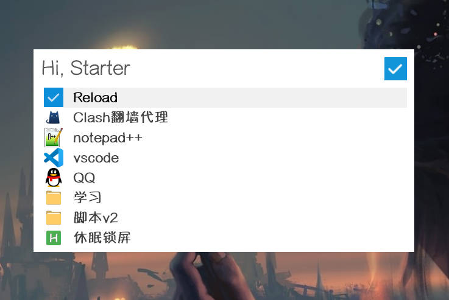
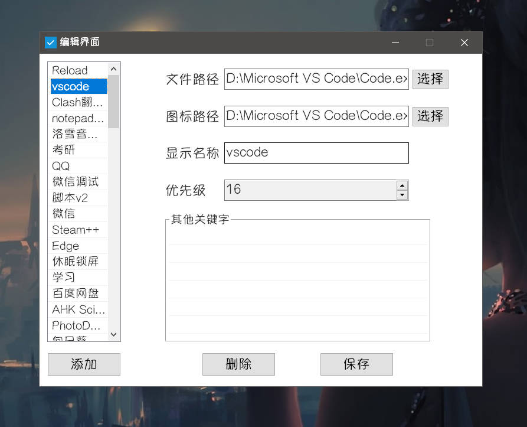
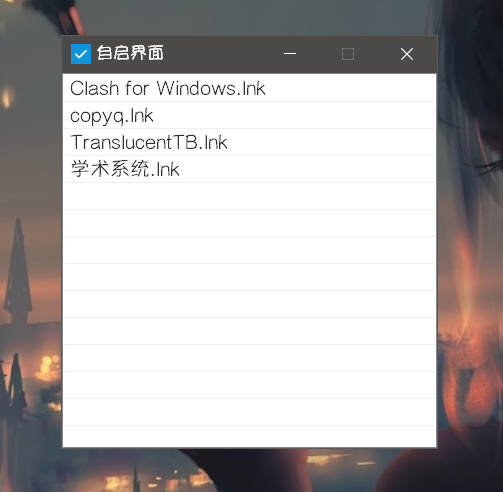

# Starter

## 介绍

`Starter` 是一款`AHK`编写的快速启动工具，旨在方便快捷地启动文件、文件夹，提高电脑的使用效率。

## 主要功能

1. 按关键字搜索列表中的项目，快速启动、打开所在文件夹等
2. 开机启动列表

## 功能细节

### 搜索界面

1. 双击`CapsLock`激活搜索界面，输入内容即可对启动列表进行搜索（匹配项的显示名称、其他关键词），显示搜索结果列表。
2. `Up`、`Down`可在列表中上下切换选中的项；` Shift`+`Enter `启动选中项；双击`Left`在文件夹中打开选中项；`Shift`+`Esc`清除输入内容或隐藏搜索界面。
3. 鼠标双击可以启动点击项，鼠标右键可以打开菜单对点击项进行启动、在文件夹中打开、编辑、删除等操作。
4. 启动项带有动态优先级，优先级越高的项在列表中显示越靠前。每次启动、在文件夹中打开，都会增加启动项的优先级。优先级范围 0-999。
5. 拖动文件到搜索界面中可以批量添加启动项
6. 搜索界面失去焦点一段时间后自动隐藏

### 编辑界面

1. 点击左侧列表中不同项可以切换至对应项的编辑页面。
2. 编辑页面显示对应项的文件路径、图标路径、显示名称、优先级、其他关键词，皆可进行修改，同时可以删除对应项。
3. 打开编辑界面时禁止启动搜索界面，避免数据冲突
4. 拖动文件到编辑界面中可以批量添加启动项

### 自启界面

1. 右键点击列表进行添加、刷新、删除操作
2. 拖动文件到自启界面中可以批量添加自启项
3. 双击列表项可以启动对应项

