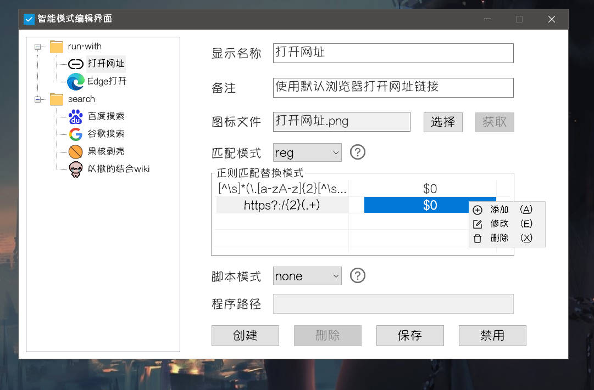
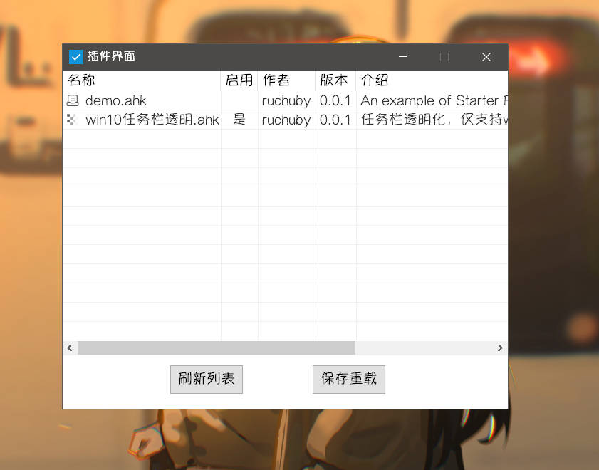

# Starter

<h1 align="center">Starter</h1>

智能、快捷地启动文件、文件夹，执行操作，提高电脑的使用效率

  
  
  
    </a>

## 1. 开始使用

1. Github下载: [Github Releases ](https://github.com/ruchuby/Starter/releases) 或 蓝奏云下载: [蓝奏云](https://wwi.lanzoup.com/b01kb1g4j) 密码: 9vge 。

2. 若需要截图中的字体，可在上方蓝奏云链接下载后安装，Starter将**优先使用**该字体。

3. 解压后运行`创建快捷方式.bat`, 运行创建好的`Starter.lnk`即可启动。

4. 刚刚安装好的Starter是一张白纸，在添加各种配置之后，它将成为你最得心应手的启动工具。

5. 通过编写和加载插件，Starter具备无限的潜力和可能性。

## 2. 主要功能

1. 启动模式下按关键字搜索启动项，快速启动、打开所在文件夹等。
2. 智能模式下按一定匹配规则搜索执行项，执行一定的操作，如使用百度搜索、使用记事本打开等。
3. 开机自启，且在开机时启动指定的程序列表。
4. 导出、导入用户数据和插件。
5. 加载Starter插件。
6. 检查更新。

## 3. 功能细节

### 3.1 搜索界面

1. **双击**`CapsLock`激活搜索界面，输入内容即可进行搜索，显示搜索结果列表。
2. `Up`、`Down`可在列表中**上下切换**选中的项；`Esc`**清空**输入内容或**隐藏**搜索界面。
3. `Tab`可在**智能模式**和**启动模式**之间切换。
4. 搜索界面失去焦点一段时间后**自动隐藏**，自动隐藏后15s内**保留搜索结果**
5. 拖动文件到搜索界面中可以批量添加**启动项**。

#### 3.1.2 启动模式

搜索界面**默认为启动模式**，启动模式对应**启动项**。

1. 启动模式下搜索结果匹配启动项的**显示名称**、**其他关键词**，输入内容为空时**显示所有**启动项。
2. `鼠标双击`、 `Enter`**启动**选中项，鼠标**右键**可打开菜单对选中项进行启动、在文件夹中打开、编辑、删除操作。
3. 启动项带有**动态优先级**，优先级越高的项在列表中显示越**靠前**。**每次**启动、在文件夹中打开，都会**增加**启动项的优先级。优先级范围 0-999。

#### 3.1.2 智能模式

智能模式对应**执行项**。

1. 智能模式下搜索结果为符合执行项**匹配条件**的所有结果（具体见3.3.1 匹配模式），输入内容为空时**不显示任何**执行项。
2. `鼠标双击`、 `Enter`执行选中项，鼠标右键可打开菜单对选中项进行执行、编辑操作。

### 3.2 启动模式编辑界面

右键右下角托盘图标打开软件菜单，可从中打开启动模式编辑界面。

1. 点击**左侧列表**中不同项可以**切换**至对应项的编辑页面。
2. 编辑页面显示对应项的文件路径、图标路径、显示名称、优先级、其他关键词，皆可进行**修改**。
3. 打开启动模式编辑界面时**禁用快捷键**启动搜索界面。
4. **拖动文件**到启动模式编辑界面中可以**批量添加**启动项。
5. 点击**添加**按钮，在出现的文件选择界面中添加新启动项。
6. 点击**删除**按钮，删除当前启动项。
7. 点击**保存**按钮，确认后将当前项的变动保存。
8. 右键**其他关键字列表**，打开其他关键字菜单，可进行添加、编辑、删除关键字。

### 3.3 智能模式编辑界面

右键右下角托盘图标打开软件菜单，可从中打开智能模式编辑界面。

1. 点击**左侧树状图**中不同项可以**切换**至对应项的编辑页面。
2. 编辑页面显示对应项的显示名称、备注、图标文件、匹配模式、脚本模式等，可据情况进行**修改**。
3. 打开启动模式编辑界面时**禁用快捷键**启动搜索界面。

#### 3.3.1 匹配模式

##### 3.3.1.1 字符串模式(str)

搜索栏输入内容为任意字符串时匹配，输入内容**直接传递给启动处理程序。**

##### 3.3.1.2 正则匹配替换模式(reg)

搜索栏输入内容满足**下方左侧**列表中任意表达式时匹配（列表从上到下依次比较，满足则停止），并且输入内容经**下方右侧**列表相应行**正则替换后传递给启动处理程序**。

右键**下方左右两侧**列表，打开菜单，可进行添加、编辑、删除列表项。

正则匹配与替换参考:

1. [正则表达式30分钟入门教程 (deerchao.cn)](https://deerchao.cn/tutorials/regex/regex.htm#mission)
2. [RegExReplace - 语法 & 使用 | AutoHotkey v2 (autoahk.com)](https://www.autoahk.com/help/autohotkey/v2/docs/commands/RegExReplace.htm)

##### 3.3.1.3 匹配模式优先级顺序

搜索结果的优先排列顺序为：

1. reg模式 > str模式
2. reg模式下：**匹配的正则项**在**该启动项**所有正则项中越靠前，优先级越高。 比如：A启动项的第2条才匹配，B启动项的第1条就匹配，则B在A前面

#### 3.3.2 启动分组(run-with)

**启动处理程序**将收到的内容按**执行项**的脚本模式进行执行启动。

##### 3.3.2.1 脚本模式

脚本模式目前仅对**启动分组**中的执行项有效。

###### 3.3.2.1.1 无模式

启动处理程序**直接执行**收到的内容，即`Run(target)`细节可参考[Run / RunWait - 语法 & 使用 ](https://www.autoahk.com/help/autohotkey/v2/docs/commands/Run.htm)中的`Target`参数。

此时程序路径无效。

###### 3.3.2.1.2 单参数模式

启动处理程序将收到的内容视为**一个**命令行参数(即对收到内容中的双引号进行转义，再用双引号包裹)，启动下方程序路径。

###### 3.3.2.1.3 多参数模式

启动处理程序将收到的内容视为**完整**命令行参数(即对收到内容不做任何处理)，启动下方程序路径。

#### 3.3.3 搜索分组(search)

**启动处理程序**将收到的内容填充到**搜索URL**中"{}"所在位置，打开填充后的URL。

**获取图标**: 点击获取按钮，可以尝试获取**搜索URL**对应的网站图标，下载至用户数据。

### 3.4 插件界面

右键右下角托盘图标打开软件菜单，可从中打开插件界面。

1. **双击**列表项可以启用/禁用插件
2. 点击**保存重载**，可以保存当前启用/禁用状态，然后重启以加载启用的插件
3. 点击**刷新列表**，可以重新读取插件目录内的插件信息，刷新插件界面列表
4. 自定义插件编写，简单示例参考软件目录下`\src\Plugin\demo.ahk`，后续考虑优化、丰富插件相关内容

### 3.5 自启界面

右键右下角托盘图标打开软件菜单，可从中打开自启界面。

1. Starter**开机自启时**会自动运行自启界面列表中的所有项。
2. **右键**点击列表打开**菜单**进行添加、刷新、删除操作。
3. **拖动文件**到自启界面中可以**批量添加**自启项。
4. **双击**列表项可以启动对应项。

### 3.6 关于界面

1. 显示当前版本号。
2. 显示项目主页。
3. 检查更新。

### 3.7 开机自启

右键右下角托盘图标打开软件菜单，可从中**开启**、**关闭**Starter的开机自启。

**开启**开机自启时，Starter才会在开机启动时运行自启界面列表中的所有项。

### 3.8 用户数据

右键右下角托盘图标打开软件菜单，可从中进入用户数据**子菜单**

1. 打开数据目录: 打开用户数据所在目录
2. 导出用户数据: 选择保存目录、导出选项，将相关内容导出为zip文件
3. 导入用户数据: 选择数据路径、导入选项，将相关内容导入至Starter

## 4. AHK编程相关

### 4.1 编程范式

由于软件的功能并不复杂，具体功能实现暂且不提，主要介绍一下本程序中AHK Gui的编程范式。

#### 4.1.1 事件驱动

传统的Gui编程是基于事件驱动

比如用户点击按钮、输入内容等事件触发回调，在回调中我们对需要改变的数据直接进行修改、对要需要改变的UI控件进行操作。

好处是简单粗暴，缺点也很明显，当某事件与很多控件、数据相关时，这个直接修改的代码写起来会非常痛苦，又臭又长。

#### 4.1.2 数据驱动

而数据驱动则是另一种思想：一切皆数据，我们的UI控件表现如此是因为我们的数据如此，当我们的数据修改后，UI界面就应该根据数据表现为新的状态。

缺点是代码写起来比较复杂，优点是对于复杂的事件回调，代码反而简洁许多。

ahk v2版本的新语法中支持了比较现代的`class`、`getter`、`setter`，因此我们可以方便地使用数据驱动（相对v1版本）

数据驱动的关键是定义好数据（MVC中的`Model`）与视图（MVC中的`View`）的交互层（`MVC`中的`Controller`）

> 由于本程序一开始也是使用事件驱动，后来才尝试改用数据驱动，因此没有很好的使用MVC规范，仅供参考

#### 4.1.3 实现思路

##### 4.1.3.1 数据 -> UI: 

用抽象的数据（AHK中称为动态属性）来实现。对抽象的数据进行修改可以触发抽象数据的`setter`，在其`setter`中修改真实数据(若关联到其他数据，也可以修改其他数据的抽象数据，进一步套娃触发)，并且对当前数据直接关联的UI控件进行修改。如此，实现了改变数据后UI也随之变动。

##### 4.1.3.2 UI -> 数据: 

为UI控件设置事件回调`OnEvent`。用户的交互信息，如点击、输入内容等可以触发相应的事件回调，事件回调中修改对应抽象数据的值为当前控件的值（或其他值）。

##### 4.1.3.3 注意事项

因为代码层面上对AHK控件修改不会触发其`OnEvent`，所以用户操作引起**UI -> 数据 -> UI**就终止，并不会造成死循环。其他语言环境则需要考虑在**数据->UI**环节中鉴别是否需要中断（比如判断对应值无变化则中断）。
