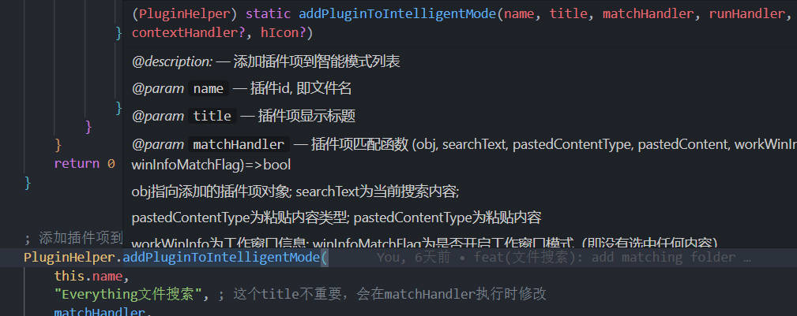
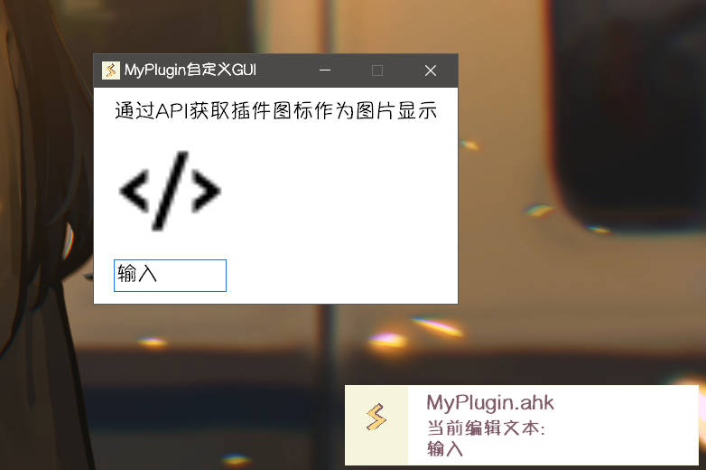

从这里开始，你将了解如何创造一个简单的 `Starter` 插件应用。

## 创建插件文件

`Starter` 插件文件就是普通的 `AHK` 脚本文件，支持 `ahk`, `ah2` 两种文件后缀。

**插件目录：** `Starter\src\Plugin`

在插件目录内新建一个文件 `MyPlugin.ahk`，本文将以此插件为例子展开。

:::tip
插件目录在 **Starter** 目录下 `\src\Plugin`
:::

## 插件信息

**Starter** 通过解析目录内(不包括子目录)的 `AHK` 脚本文件是否含有插件信息来判断是否为插件文件。

```ahk
/*
===Starter Plugin Info==>
{
    "author": "AkiChase",
    "version": "0.0.1",
    "introduction": "Starter Plugin example",
    "icon": "iVBORw0KGgoAAAANSUhEUgAAACAAAAAgCAYAAABzenr0AAAAAXNSR0IArs4c6QAAAgNJREFUWEft1UuozVEUx/HPHRmaMFBMTDwmYiJSQimUMqAoAwNRQoSSR3kVxfWIIjISojwGiiLKgBkTYSADZGAkE2VAS3vXdvr/z/2fc27nls6a/fde+7e+e62113/IGNvQGMc3APivMnALE1NPLWraW6OVgZl4k4Jew/p+A+zBiRR0LW72G+A5FuArpuFHPwHm4mUKeAUbmwYPvyY9sAlTsL9G+Eixtwr3kt9RfMKldkAjAZzFNhxrA/Aas/Axpf9XAbAP57C9DqIOIOp4AUvSwbjlwQqRqHvUP+w8thY+h3EgfT/BFrxv1agCiDRG8EnJ+TM240EFQM5QbC3Dw8JnBS5iclqLBg2Iu6VOK0DUOW6b7XZqqu81KfyAqXiLmAWtNh6XsbrYiKxEf/y1EuA64g1n24nTNYFjeSGepf2T2N3GdweGi/0bWNcrwFVsSKIxejNMFUcjgDjYSQm+YQJeYU7N7TsqQdZo0oTxOh6nA1HP3O0lR1dNmAVan+Fx7C3U48+XG2teMQlLgEPF0+3oGZYi+ZmdQdQx20+MwwvMr0l/ngNdDaJSM0bx9AJgKR4lh+iZmJJVFgBfeh3FVcJ3EH0SNhsxiru2kf4FVcK/0+JTLO46cjrYKcDyYiTvwql+A9zHyhR0Bt71GyDSHhZDaE2vweN8pyUYjZj/aAwABhn4A2ymYyH5RzvQAAAAAElFTkSuQmCC"
}
<==Starter Plugin Info===
*/
```
通过解析 `===Starter Plugin Info==>` 与 `<==Starter Plugin Info===` 之间的 `JSON` 格式内容，插件将显示在**插件界面**中

- author

插件作者

- version

插件版本，未来可能作为插件更新检测的依据

- icon (可选)

插件的图标，使用**无头部**的base64图片，尺寸最好是 `32 * 32`，格式建议 `png`

## 基本模板

为了规范的编写插件，在此提供一个插件基本模板。

在编写插件功能之前，你可以直接照搬这些内容。

``` ahk
; MyPlugin.ahk

/*
===Starter Plugin Info==>
{
    "author": "AkiChase",
    "version": "0.0.1",
    "introduction": "Starter Plugin example",
    "icon": "iVBORw0KGgoAAAANSUhEUgAAACAAAAAgCAYAAABzenr0AAAAAXNSR0IArs4c6QAAAgNJREFUWEft1UuozVEUx/HPHRmaMFBMTDwmYiJSQimUMqAoAwNRQoSSR3kVxfWIIjISojwGiiLKgBkTYSADZGAkE2VAS3vXdvr/z/2fc27nls6a/fde+7e+e62113/IGNvQGMc3APivMnALE1NPLWraW6OVgZl4k4Jew/p+A+zBiRR0LW72G+A5FuArpuFHPwHm4mUKeAUbmwYPvyY9sAlTsL9G+Eixtwr3kt9RfMKldkAjAZzFNhxrA/Aas/Axpf9XAbAP57C9DqIOIOp4AUvSwbjlwQqRqHvUP+w8thY+h3EgfT/BFrxv1agCiDRG8EnJ+TM240EFQM5QbC3Dw8JnBS5iclqLBg2Iu6VOK0DUOW6b7XZqqu81KfyAqXiLmAWtNh6XsbrYiKxEf/y1EuA64g1n24nTNYFjeSGepf2T2N3GdweGi/0bWNcrwFVsSKIxejNMFUcjgDjYSQm+YQJeYU7N7TsqQdZo0oTxOh6nA1HP3O0lR1dNmAVan+Fx7C3U48+XG2teMQlLgEPF0+3oGZYi+ZmdQdQx20+MwwvMr0l/ngNdDaJSM0bx9AJgKR4lh+iZmJJVFgBfeh3FVcJ3EH0SNhsxiru2kf4FVcK/0+JTLO46cjrYKcDyYiTvwql+A9zHyhR0Bt71GyDSHhZDaE2vweN8pyUYjZj/aAwABhn4A2ymYyH5RzvQAAAAAElFTkSuQmCC"
}
<==Starter Plugin Info===
*/


#Include ..\Utils\PluginHelper.ah2 ; 引入插件工具模块
PluginHelper.addEntryFunc((*) => Plugin_MyPlugin.main()) ; 添加入口函数等待Starter执行


; 使用类，避免变量名、函数名污染
class Plugin_MyPlugin {

    ; 入口函数，可以理解为插件的初始化函数
    static main(){
        ; 在此处编写插件的主体内容
    }
}
```

## 插件功能

### 1. 添加插件专属菜单

最简单的功能莫过于将一个专属菜单添加到 **Starter**菜单中。

:::tip
此处的**菜单**指的是右键右下角托盘图标打开的菜单
:::

这里就要介绍插件编写离不开的工具模块 `PluginHelper`

在模板代码的最开始，我们就通过 `#Include ..\Utils\PluginHelper.ah2` 引入了这个模块

:::tip
`PluginHelper` 在 **Starter** 中已经 `#include` 过。

所以在此重复引用这个模块的目的仅仅是为了**获得代码提示**，使用**vscode**配合[ahk2扩展](https://marketplace.visualstudio.com/items?itemName=thqby.vscode-autohotkey2-lsp)，

可以获得非常详细的代码提示。


:::

为了**代码结构清晰**和**避免变量污染**，把一定规模的代码定义为一个新的函数并给出注释，将其放在`main`函数中执行。

养成良好的代码习惯，对看代码、写代码都有好处。

```ahk
class Plugin_MyPlugin {

    ; 菜单初始化
    static menuInit(){
        ; 首先创建一个菜单对象，也就是 `MyPlugin` 的专属菜单对象。
        m:=Menu()
        ; 然后为这个菜单简单添加几个功能
        m.Add("MsgBox", (*) => MsgBox("使用msgbox弹窗"))
        ; 此处使用了另一个非常常用的Starter API: PluginHelper.Utils.tip()方法
        m.Add("Tip", (*) => PluginHelper.Utils.tip("提示", "使用WiseGui弹窗", 1500))
        ; 最后通过 PluginHelper.pluginMenu 属性，访问Starter为插件提供的菜单对象。
        ; 将专属菜单对象作为子菜单添加到 PluginHelper.pluginMenu 中
        PluginHelper.pluginMenu.Add("MyPlugin专属菜单", m)

        ; 如果之后还需要访问到这个专属菜单对象，可以将其添加到this(指向Plugin_MyPlugin)
        ; this.menu:=m
    }
}
```

:::tip
如果没有类相关的知识，你可能会疑惑`static`前缀是什么。

在编写插件时，你只要记住 `static` 前缀的函数 `xxx` 才能直接通过类名`Plugin_MyPlugin.xxx` 访问

而`static` 前缀的函数体内一般 `this` 指向当前类，也就是 `Plugin_MyPlugin`
:::


最后，别忘了在 `static main(){}` 函数体中添加`this.menuInit()`，这样`main`入口函数被 **Starter** 执行时，你的`menuInit`函数才会被执行。

**本次给出完整代码，之后的内容仅仅给出功能相关的代码。**

```ahk
#Include ..\Utils\PluginHelper.ah2 ; 引入插件工具模块

PluginHelper.addEntryFunc((*) => Plugin_MyPlugin.main()) ; 添加入口函数等待Starter执行

; 使用类，避免变量名、函数名污染
class Plugin_MyPlugin {

    ; 入口函数，可以理解为插件的初始化函数
    static main(){
        this.menuInit()
    }

    ; 菜单初始化
    static menuInit(){
        m:=Menu()
        m.Add("MsgBox", (*) => MsgBox("使用msgbox弹窗"))
        m.Add("Tip", (*) => PluginHelper.Utils.tip("提示", "使用WiseGui弹窗", 1500))
        PluginHelper.pluginMenu.Add("MyPlugin专属菜单", m)
    }
}
```
重启 **Starter** 后，就可以通过 **Starter菜单** > **插件功能** > **MyPlugin专属菜单** 进行访问。


### 2. 添加插件启动项{#add-plugin-to-startup-mode}

**插件启动项**的功能类似于**原生启动项**，但是只能通过插件来添加、修改。

添加**插件启动项**需要使用 `PluginHelper.addPluginToStartupMode()` API

```ahk
/**
* @description: 添加插件项到启动模式列表
* @param name 插件id, 即文件名
* @param title 插件项显示标题
* @param keywords 插件项关键字
* @param startHandler 鼠标双击、回车该插件项时执行的函数 (obj, searchText)=>any obj指向添加的插件项对象
* @param doubleRightHandler 选填, 双击Right该插件项时执行的函数 (obj, searchText)=>any obj指向添加的插件项对象
* @param contextHandler 选填, 右键该插件项时的处理函数 (obj)=>any obj指向添加的插件项对象
* @param hIcon 选填, 插件项显示的图标HICON, 默认使用插件的图标
*/
static addPluginToStartupMode(name, title, keywords, startHandler, doubleRightHandler?, contextHandler?, hIcon?)
```
直接上代码，根据代码和注释了解具体用法。

```ahk
class Plugin_MyPlugin {
    static main() {
        ; 获取插件id即文件名
        SplitPath(A_LineFile, &name)
        ; 保存到类变量，便于其他类方法访问
        this.name := name
        this.addStartupItem()
    }

    ; 添加插件启动项
    static addStartupItem() {
        ; 鼠标双击、回车当前项的处理函数
        startHandler(obj, searchText) {
            ; 使用WiseGui通知 通知标题使用了this.name即文件名，也可以使用obj.title即插件启动项标题
            PluginHelper.Utils.tip(this.name, "搜索框内容:" searchText, 1000)
            ; 隐藏搜索框
            PluginHelper.hideSearchGui()
        }

        ; 可以添加多个插件项，但每个插件的插件项应当具有相同的name，不同的title避免混淆
        PluginHelper.addPluginToStartupMode(
            this.name, ; 使用main方法中保存的插件id
            "插件示例",
            ["plugin demo", "CJSL"], ; 该启动项的其他关键字
            startHandler, ; 使用显式定义的函数
            ; 使用匿名函数作为双击Right的处理函数
            (obj, searchText) => PluginHelper.Utils.tip(obj.title, "双击Right", 1000),,
            ; 定义该插件项显示的图标HICON，此处用base64ToHICON方法将base64图片载入得到HICON
            PluginHelper.Utils.base64ToHICON("iVBORw0KGgoAAAANSUhEUgAAACAAAAAgCAYAAABzenr0AAAAAXNSR0IArs4c6QAAAnBJREFUWEfVlj9oFEEUxt+bLa6wF0whQcRCENOo2EUQYy/xZmb3sDKCoK0RhURQSFoFwdhcuNuZPY+AXKU22gmKiI2FAREbwUrwrI6dJxN2wv3Z21vZDWe2291vv/fbNx9vBmHKF065Pvy/AEKI60R0EhGPFekSEX1BxE9a68dpPqkdEEI0AcAvUjjl21BrHQw/HwGoVqsXGGMvE+E3ItosAoKIVwBg1noYYxZardarfr8RACHEDQB4aEWe5800m80fRQCCIDgax/F24nFTa/0oE4BzvoqIK1aktS4lpEIIsn5EdC+KotX9CyClXDLGzGQtCWNs2/O8541G44/TldIBKeUcEX3MkwfG2OkwDN+XCsA5n0XECADOTID4UKlUztfr9V+lAuT583GaUpZg6gC1Wu1Ar9dbdENlHJANYbfb7XQ6nd+lLoHv+6eMMe/ydIKIzkVR9KZUgCAIDsVxfBsATmRB2M0niqJr/Zr9mwHbymRP+BmG4ec87Xca3/ePx3F80N4j4uuJo1hKeYSI1gDABm3kQsR1pdRyHggp5RoR3RqjbSPislLq6w6cE3HOnyDi0oQCT7XWmRohxAYAXJ2Qkw2Xk12A/qAAwG6Ckxbav7mYmA68Syk0nzx7QUTrQ+/nh3faVIDhLdOaCCHuA8CdPEsAAA+01neHtWlbfW4AayalXDDGnM2CYIy9VUq5E9WAtDBAzr8fK+OcryDizoHEHXb+qQMlAIyctnKFsGjhvu8zQ/hs3AwoEcBZtbXWlwfmgJRykYiqAHBpDwr2W24hYksp1R4AcAo7EY0xh/cCgjH23U1A51/KsbsI7NQB/gIoe4UwRdVGRAAAAABJRU5ErkJggg==")
            ; 也可以通过 PluginHelper.getPluginHIcon(this.name) 获取插件信息中的设定的图标HICON
        )
    }
}
```
重启 **Starter** 后，呼出搜索框就可以在列表中看到当前插件启动项


回车或者鼠标双击，还有双击Right可以看到 `WishGui` 通知。


### 3. 添加自定义GUI

添加自定义GUI十分自由，可以不依赖 **Starter** 提供的API。

但是可以通过调用API使用一些 **Starter** 提供的功能、资源。

原则上只有Starter提供的插件模式无法满足需求时，才使用自定义GUI。

还是上代码，看注释。

```ahk
class Plugin_MyPlugin {
    static main() {
        SplitPath(A_LineFile, &name)
        this.name := name
        this.menuInit()
        this.guiInit()
    }

    static menuInit() {
        m := Menu()
        ; 添加到菜单中，从而通过点击菜单显示gui
        m.Add("GUI", (*) => this.gui.Show())
        PluginHelper.pluginMenu.Add("MyPlugin专属菜单", m)
    }

    static guiInit() {
        g := Gui(, "MyPlugin自定义GUI")
        g.BackColor:="FFFFFF"
        g.SetFont("s14 q5", "NSimSun")
        g.SetFont(, "雅痞-简")    ;优先使用更好看的字体

        g.AddText("", "通过API获取插件图标作为图片显示")
        ; 使用hIcon作为图片来源
        ; 注意hIcon:*务必加上*来使用图片副本
        ; 避免图片资源被用后销毁
        g.AddPicture("w100 h100", "hIcon:*" PluginHelper.getPluginHIcon(this.name))
        e := g.AddEdit("w100")
        ; 为编辑框加上change事件回调来通知变化
        e.OnEvent("Change", (ctrl, *) => PluginHelper.Utils.tip(this.name, "当前编辑文本:`n" ctrl.Value, 1000))
        ; 隐藏窗口暂不显示
        g.Show("Hide")

        ; 添加到类变量方便其他函数访问
        ; 比如在菜单中添加一项来显示gui
        this.gui := g
    }
}
```

可以在 `MyPlugin专属菜单` 中点击 `GUI` 来显示这个自定义GUI




## 最后

根据之前的内容，你应该对插件开发有了基本的了解，当然这只是插件API运用的最简单的一部分。

阅读开发文档的其他内容后，比如强大的**插件智能项**，**ImagePut** 等等，你可以试着开发一款属于你自己的 **Starter** 插件应用。

以下是 `MyPlugin.ahk` 的完整内容，作为快速上手的参考：
```ahk
; MyPlugin.ahk

/*
===Starter Plugin Info==>
{
    "author": "AkiChase",
    "version": "0.0.1",
    "introduction": "Starter Plugin example",
    "icon": "iVBORw0KGgoAAAANSUhEUgAAACAAAAAgCAYAAABzenr0AAAAAXNSR0IArs4c6QAAAgNJREFUWEft1UuozVEUx/HPHRmaMFBMTDwmYiJSQimUMqAoAwNRQoSSR3kVxfWIIjISojwGiiLKgBkTYSADZGAkE2VAS3vXdvr/z/2fc27nls6a/fde+7e+e62113/IGNvQGMc3APivMnALE1NPLWraW6OVgZl4k4Jew/p+A+zBiRR0LW72G+A5FuArpuFHPwHm4mUKeAUbmwYPvyY9sAlTsL9G+Eixtwr3kt9RfMKldkAjAZzFNhxrA/Aas/Axpf9XAbAP57C9DqIOIOp4AUvSwbjlwQqRqHvUP+w8thY+h3EgfT/BFrxv1agCiDRG8EnJ+TM240EFQM5QbC3Dw8JnBS5iclqLBg2Iu6VOK0DUOW6b7XZqqu81KfyAqXiLmAWtNh6XsbrYiKxEf/y1EuA64g1n24nTNYFjeSGepf2T2N3GdweGi/0bWNcrwFVsSKIxejNMFUcjgDjYSQm+YQJeYU7N7TsqQdZo0oTxOh6nA1HP3O0lR1dNmAVan+Fx7C3U48+XG2teMQlLgEPF0+3oGZYi+ZmdQdQx20+MwwvMr0l/ngNdDaJSM0bx9AJgKR4lh+iZmJJVFgBfeh3FVcJ3EH0SNhsxiru2kf4FVcK/0+JTLO46cjrYKcDyYiTvwql+A9zHyhR0Bt71GyDSHhZDaE2vweN8pyUYjZj/aAwABhn4A2ymYyH5RzvQAAAAAElFTkSuQmCC"
}
<==Starter Plugin Info===
*/

#Include ..\Utils\PluginHelper.ah2
PluginHelper.addEntryFunc((*) => Plugin_MyPlugin.main()) ; 添加入口函数等待Starter执行


; 使用类，避免变量名、函数名污染
class Plugin_MyPlugin {

    ; 入口函数，可以理解为插件的初始化函数
    static main() {
        ; 在此处编写插件的主体内容

        ; 获取插件id即文件名
        SplitPath(A_LineFile, &name)
        ; 保存到类变量，便于其他类方法访问
        this.name := name

        ; 为了结构清晰，下面将每一步都定义为一个函数然后执行
        ; 添加插件启动项
        this.menuInit()
        ; 添加插件启动项
        this.addStartupItem()

        this.guiInit()
    }

    static guiInit() {
        g := Gui(, "MyPlugin自定义GUI")
        g.BackColor:="FFFFFF"
        g.SetFont("s14 q5", "NSimSun")
        g.SetFont(, "雅痞-简")    ;优先使用更好看的字体

        g.AddText("", "通过API获取插件图标作为图片显示")
        ; 使用hIcon作为图片来源
        ; 注意hIcon:*务必加上*来使用图片副本
        ; 避免图片资源被用后销毁
        g.AddPicture("w100 h100", "hIcon:*" PluginHelper.getPluginHIcon(this.name))
        e := g.AddEdit("w100")
        ; 为编辑框加上change事件回调来通知变化
        e.OnEvent("Change", (ctrl, *) => PluginHelper.Utils.tip(this.name, "当前编辑文本:`n" ctrl.Value, 1000))
        ; 隐藏窗口暂不显示
        g.Show("Hide")

        ; 添加到类变量方便其他函数访问
        ; 比如在菜单中添加一项来显示gui
        this.gui := g
    }

    ; 菜单初始化
    static menuInit() {
        ; 首先创建一个菜单对象，也就是 `MyPlugin` 的专属菜单对象。
        m := Menu()
        ; 然后为这个菜单简单添加几个功能
        m.Add("MsgBox", (*) => MsgBox("使用msgbox弹窗"))
        ; 此处使用了另一个非常常用的Starter API: PluginHelper.Utils.tip()方法
        m.Add("Tip", (*) => PluginHelper.Utils.tip("提示", "使用WiseGui弹窗", 1500))

        m.Add("GUI", (*) => this.gui.Show())
        ; 最后通过 PluginHelper.pluginMenu 属性，访问Starter为插件提供的菜单对象。
        ; 将专属菜单对象作为子菜单添加到 PluginHelper.pluginMenu 中
        PluginHelper.pluginMenu.Add("MyPlugin专属菜单", m)

        ; 如果之后还需要访问到这个专属菜单对象，可以将其添加到this(指向Plugin_MyPlugin)
        ; this.menu:=m
    }

    ; 添加插件启动项
    static addStartupItem() {
        ; 鼠标双击、回车当前项的处理函数
        startHandler(obj, searchText) {
            ; 使用WiseGui通知 通知标题使用了this.name即文件名，也可以使用obj.title即插件启动项标题
            PluginHelper.Utils.tip(this.name, "搜索框内容:" searchText, 1000)
            ; 隐藏搜索框
            PluginHelper.hideSearchGui()
        }

        ; 可以添加多个插件项，但每个插件的插件项应当具有相同的name，不同的title避免混淆
        PluginHelper.addPluginToStartupMode(
            this.name, ; 使用main方法中保存的插件id
            "插件示例",
            ["plugin demo", "CJSL"],
            startHandler, ; 使用显式定义的函数
            ; 使用匿名函数作为双击Right的处理函数
            (obj, searchText) => PluginHelper.Utils.tip(obj.title, "双击Right", 1000), ,
            ; 定义该插件项显示的图标HICON，此处用base64ToHICON方法将base64图片载入得到HICON
            PluginHelper.Utils.base64ToHICON("iVBORw0KGgoAAAANSUhEUgAAACAAAAAgCAYAAABzenr0AAAAAXNSR0IArs4c6QAAAnBJREFUWEfVlj9oFEEUxt+bLa6wF0whQcRCENOo2EUQYy/xZmb3sDKCoK0RhURQSFoFwdhcuNuZPY+AXKU22gmKiI2FAREbwUrwrI6dJxN2wv3Z21vZDWe2291vv/fbNx9vBmHKF065Pvy/AEKI60R0EhGPFekSEX1BxE9a68dpPqkdEEI0AcAvUjjl21BrHQw/HwGoVqsXGGMvE+E3ItosAoKIVwBg1noYYxZardarfr8RACHEDQB4aEWe5800m80fRQCCIDgax/F24nFTa/0oE4BzvoqIK1aktS4lpEIIsn5EdC+KotX9CyClXDLGzGQtCWNs2/O8541G44/TldIBKeUcEX3MkwfG2OkwDN+XCsA5n0XECADOTID4UKlUztfr9V+lAuT583GaUpZg6gC1Wu1Ar9dbdENlHJANYbfb7XQ6nd+lLoHv+6eMMe/ydIKIzkVR9KZUgCAIDsVxfBsATmRB2M0niqJr/Zr9mwHbymRP+BmG4ec87Xca3/ePx3F80N4j4uuJo1hKeYSI1gDABm3kQsR1pdRyHggp5RoR3RqjbSPislLq6w6cE3HOnyDi0oQCT7XWmRohxAYAXJ2Qkw2Xk12A/qAAwG6Ckxbav7mYmA68Syk0nzx7QUTrQ+/nh3faVIDhLdOaCCHuA8CdPEsAAA+01neHtWlbfW4AayalXDDGnM2CYIy9VUq5E9WAtDBAzr8fK+OcryDizoHEHXb+qQMlAIyctnKFsGjhvu8zQ/hs3AwoEcBZtbXWlwfmgJRykYiqAHBpDwr2W24hYksp1R4AcAo7EY0xh/cCgjH23U1A51/KsbsI7NQB/gIoe4UwRdVGRAAAAABJRU5ErkJggg==")
            ; 也可以通过 PluginHelper.getPluginHIcon(this.name) 获取插件信息中的设定的图标HICON
        )
    }
}
```


