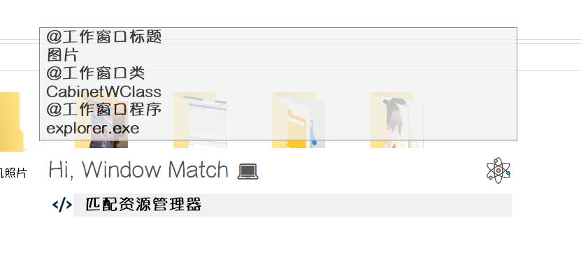

**插件智能项**的功能非常强大，可以通过自定义匹配函数，根据当前输入内容的类型，具体内容，工作窗口等信息判断是否匹配当前插件智能项。

具体来说，比如，将图片粘贴到智能模式搜索框中，就可以根据输入内容的类型是图片，而匹配到**OCR图片识别**插件添加的智能项。

比如，将单个文件夹粘贴到搜索框中，就可以根据输入内容的类型是文件，再根据当前文件是文件夹，而匹配到通过**文件搜索**插件添加的智能项。

而其他方面的操作类似于**插件启动项**，在此不多赘述。

:::tip
与**插件启动项**不同，**智能启动项**没有 `doubleRightHandler` 参数，其他用法类似。
:::

主要内容集中在**自定义匹配**函数

## API

添加**插件智能项**需要使用 `PluginHelper.addPluginToIntelligentMode()` API

参数及说明：[PluginHelper.addPluginToIntelligentMode](../../api/addPluginToIntelligentMode.md)

## 简单应用

自定义匹配函数的应用，即 `matchHandler` 参数

### 1. 文本匹配

自由组合文本匹配，matchHandler返回0则不匹配，返回非0则匹配

```ahk
; 添加插件智能项
static addIntelligentItem() {
    ; 自定义匹配函数
    matchHandler(obj, searchText, pastedContentType, *) { ; 使用*忽略多余参数
        ; 带有非文本类型的都不匹配
        if (pastedContentType != 'text')
            return 0
        ; 若searchText为"PPWB"开头部分
        if (PluginHelper.Utils.strStartWith("PPWB", searchText)
            || searchText == '1234' ;或者searchText为1234
            || InStr(searchText, "6") ; 或者searchText包含6
        )
            return 1 ;则匹配

        return 0 ; 其他情况也不匹配
    }

    PluginHelper.addPluginToIntelligentMode(this.name,
        "匹配文本",
        matchHandler,
        (obj, *) => PluginHelper.Utils.tip(this.name, obj.title)
    )
}
```

如图，符合`InStr(searchText, "6")`而匹配


### 2. 输入类型匹配

```ahk
; 添加插件智能项
static addIntelligentItem() {
    ; 自定义匹配函数
    matchHandler(obj, searchText, pastedContentType, pastedContent, *) { ; 使用*忽略多余参数
        if (pastedContentType == 'file' && ; 文件类型 且
            pastedContent.Length == 1 &&      ; 文件数量为1 且
            InStr(FileExist(pastedContent[1]), "D") ; 文件为文件夹
        )
            return 1 ; 符合则匹配
        return 0 ; 否则不匹配
    }

    PluginHelper.addPluginToIntelligentMode(this.name,
        "匹配单个文件夹",
        matchHandler,
        (obj, *) => PluginHelper.Utils.tip(this.name, obj.title)
    )
}
```

如图，符合单个文件夹而匹配


### 3. 工作窗口匹配

:::tip
工作窗口模式是按下**智能搜索**快捷键时，若当前**没有选中任何内容**，则**Starter**将获取工作窗口信息，进入工作窗口模式下的智能模式搜索框。

搜索框会短暂显示工作窗口的信息，插件可以根据此时的工作窗口信息进行匹配
:::

通过工作窗口信息，匹配资源管理器

```ahk
static addIntelligentItem() {
    ; 自定义匹配函数
    matchHandler(obj, searchText, pastedContentType, pastedContent, workWinInfo, winInfoMatchFlag) {
        ; 非工作窗口模式不匹配
        ; 只有工作窗口模式下，窗口信息才是有效的
        ; 否则可能是上次工作窗口模式的信息
        if (!winInfoMatchFlag)
            return 0
        
        pName := workWinInfo.processName
        cName := workWinInfo.class
        ; 返回是否满足资源管理器窗口特征 (用或连接)
        return (pName == 'explorer.exe' || cName == "CabinetWClass" || cName == "ExploreWClass")
    }

    PluginHelper.addPluginToIntelligentMode(this.name,
        "匹配资源管理器",
        matchHandler,
        (obj, *) => PluginHelper.Utils.tip(this.name, obj.title)
    )
}
```


