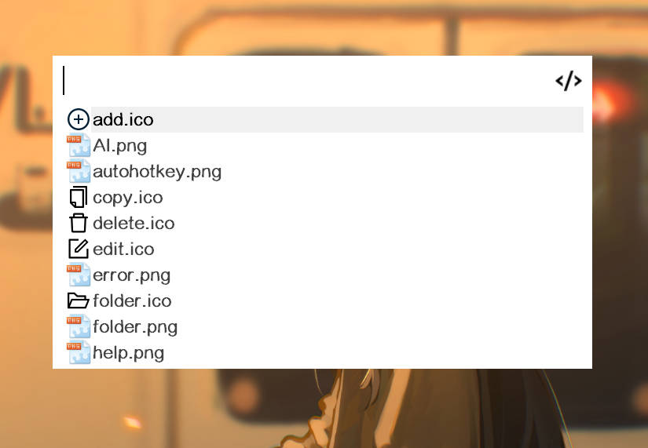

在理解**插件模式**的基本应用之后，可以尝试进阶应用。

## 动态获取数据

动态获取数据一般是在 `searchHandler` 运行时，动态地从数据来源获取数据，然后将其添加、显示在列表中。

这个数据来源可以是**网络**、**其他程序**等等，只要包含了你需要列举的数据，都可以作为数据来源。

在此，以[网页搜索](../../plugin/web-search.md)插件源码中的`searchHandler`为例子，稍作修改并添加注释：

```ahk
searchHandler(that, searchText) {
    if (searchText) {
        ; 如果有搜索内容        
        ; 进行网络请求，获取当前searchText的搜索联想词
        res := this.outer.request(this.lxUrl PluginHelper.Utils.UrlEncode(searchText))
        ; 重置搜索结果数据
        that.pluginSearchResult := []
        ; 对网络请求结果进行解析、转换
        if (res && res := PluginHelper.Utils.globalMatch(res, '\<suggestion data="(.*?)"\/\>')) {
            ; 有联想词
            ; 提前对搜索结果数组进行扩容
            that.pluginSearchResult.Capacity := res.length + 1
            ; 添加至搜索结果数组
            for item in res
                that.pluginSearchResult.Push(item[1])
            ; 如果联想词中不包括当前搜索内容，则把当前搜索内容插入在第一位
            (that.pluginSearchResult.Has(1) && that.pluginSearchResult[1] = searchText)
            ? 0 : that.pluginSearchResult.InsertAt(1, searchText)
        } else ; 无联想词，仅插入当前搜索内容
            that.pluginSearchResult.Push(searchText)
    } else ; 搜索内容为空时什么都不显示
        that.pluginSearchResult := []

    ;重置列表
    that.listView.Opt("-Redraw")    ;禁用重绘
    that.listView.Delete()
    ; 添加搜索结果到列表
    for item in that.pluginSearchResult {
        that.listView.Add(, item)
    }
    that.resizeGui() ;根据搜索结果数量调整gui尺寸 并启用重绘
}
```

如此就实现了**网页搜索**插件中的联想词效果。

## 图标相关

### 相关概念

`listView` 是可以使用图标的，在插件模式中当然也可以为每个列表项添加图标。

不过需要首先了解一下 `PluginMode` 模块的几个成员。

- `that.imgPathToImgListIndex`

`imgPathToImgListIndex` 是 `Map` 对象，用于存储**图片路径关键字**到[ImageList](https://orz707.gitee.io/v2/docs/commands/ListView.htm)中图标序号的映射关系，方便添加图标到`listView`中。

- `that.imgListID`

当前 `listView` 绑定的 `ImageList` 的id，一般用于添加图标到 `ImageList` 中，即[IL_Add()](https://orz707.gitee.io/v2/docs/commands/ListView.htm#IL_Add)

- `that.reloadLVIL(ILFlag)`

`reloadLVIL(ILFlag)` 方法将清空 `listView` ，

若 `ILFlag` 为真，还会重置 `imgPathToImgListIndex`，销毁旧的 `ImageList`，创建新 `ImageList` 并绑定到 `listView` 上

简言之，**重置列表和图标资源**。

### 简易文件夹示例 Plus

接下来我们升级一下基础篇的[简易文件夹示例](./basics.md#简易文件夹示例)，让这个示例的列表同时支持图标。

```ahk
static showPluginMode() {
    ; 构造文件夹相关数据
    searchData := []
    ; PluginHelper.imgDir 为Starter存放图片资源的目录
    loop files PluginHelper.imgDir "\*.*" {
        searchData.Push({
            title: A_LoopFileName,
            keywords: PluginHelper.Utils.chineseFirstChar(A_LoopFileName),
            path: A_LoopFileFullPath
        })
    }

    ; 此处that指的是 pluginMode 模块，即插件模式
    searchHandler(that, searchText) {
        ; 如果有搜索内容则进行匹配
        if (StrLen(searchText)) {
            that.pluginSearchResult := [] ; 重置 pluginSearchResult
            for data in that.pluginSearchData {
                ; 如果搜索内容是title或者keywords的一部分则添加到搜索结果
                if (InStr(data.title, searchText) || InStr(data.keywords, searchText))
                    that.pluginSearchResult.Push(data)
            }
        } else ; 否则显示全部
            that.pluginSearchResult := that.pluginSearchData

        ;重置列表
        that.listView.Opt("-Redraw")    ;禁用重绘
        that.listView.Delete()
        for data in that.pluginSearchResult {
            SplitPath(data.path, , , &ext) 
            ; 实际操作时建议在数据加载阶段就把ext计算并储存，避免在此重复计算ext的值
            if (ext = 'ico') {
                ; ico文件使用全路径作为imgPath
                that.listView.Add("icon" that.imgPathToImgListIndex[data.path], data.title)
            } else {
                ; 其他文件使用后缀作为imgPath
                that.listView.Add("icon" that.imgPathToImgListIndex[ext], data.title)
            }
        }
        ; 调整gui尺寸 并启用重绘
        that.resizeGui()
    }

    runHandler(that, rowNum) {
        ; 通过pluginSearchResult和当前启动的行号访问到当前数据
        curData := that.pluginSearchResult[rowNum]
        ; 此处的this指的是当前插件，不要和that混淆
        PluginHelper.hideSearchGui() ; 隐藏搜索框
        PluginHelper.Utils.tip(this.name, "在文件夹中显示:`n" curData.path)
        PluginHelper.Utils.openFileInFolder(curData.path) ; 在文件夹中显示当前文件
    }

    ; 定义预加载图标处理函数
    ; 该函数会在进入插件模式和reloadLVIL(true)时被执行
    loadImgsHandler(that) {
        for data in that.pluginSearchData {
            SplitPath(data.path, , , &ext)
            if (ext = 'ico') {
                ; 由于ico图片资源的图标是不同的，每个都要加载
                ; 所以使用文件全路径作为imgPath
                ; 而作为图标的资源文件自然就是ico文件本身
                that.imgPathToImgListIndex[data.path] := IL_Add(that.imgListID, data.path)
                ; 此处仅仅是示例，实际上还需要考虑到图标是否会加载失败即 IL_Add 返回 0
                ; 失败则应当使用一个默认图标，避免出现空白

            } else {
                ; 而其他文件类型比如png图片资源的图标使用相同的，不重复加载
                ; 所以使用文件后缀作为imgPath
                ; 我们可以通过工具函数获取指定文件路径关联的图标的hIcon
                if (!that.imgPathToImgListIndex.Has(ext)) {
                    hIcon := PluginHelper.Utils.associatedHIcon(data.path)
                    that.imgPathToImgListIndex[ext] := IL_Add(that.imgListID, "HICON:*" hIcon)
                    ; 和ico中一样，实际操作时应当加载失败的判断
                }
            }
        }
    }

    PluginHelper.showPluginMode(
        searchData,
        searchHandler,
        runHandler, {
            loadImgsHandler: loadImgsHandler,
            thumb: PluginHelper.getPluginHIcon(this.name) ; 搜索框图标
        }
    )
}
```

效果如图：




:::tip
如果有动态获取数据或者异步加载数据的情况下，可能会出现图标无法提前全部预加载的情况

那么就要把图标加载也放在`searchHandler`中，在**获取新数据后**根据情况进行图标加载
:::

## 粘贴非文本内容、拖入文件

请细看API文档[showPluginMode](../../api/showPluginMode.md)中 `pasteContentHandler`, `dropFilesHandler` 的相关解释，在此仅仅给两个代码片段，作为参考

```ahk
; 粘贴文件/位图处理函数
pasteContentHandler(that, typeName, content?) {
    if (typeName != "file") ;非文件类型都不允许
        return 0
    if (!IsSet(content)) {
        content := A_Clipboard
        if (InStr(content, "`r`n")) ; 不允许多文件
            return false
        return InStr(FileExist(content), "D") ;仅允许单文件夹
    }
    else { ;粘贴完成后的触发
        PluginHelper.placeholder := "在文件夹内搜索"
        t := PluginHelper.searchText
        PluginHelper.searchText := t ; 直接触发搜索
        PluginHelper.setSearchTextSel(StrLen(t)) ; 游标移动到最后
    }
}
```

``` ahk
; 拖入文件处理函数
dropFilesHandler(that, fileList, pre) {
    if (pre) {
        if (fileList.Length > 1)
            return false
        return InStr(FileExist(fileList[1]), "D") ;仅允许单文件夹
    } else { ;拖入生效后的触发
        PluginHelper.placeholder := "在文件夹内搜索"
        t := PluginHelper.searchText
        PluginHelper.searchText := t ; 直接触发搜索
        PluginHelper.setSearchTextSel(StrLen(t)) ; 游标移动到最后
    }
}
```

## 触底回调

在[文件搜索](../../plugin/file-find.md)插件中就使用了**触底回调**，实现异步加载数据，而不是直接加载全部数据。

由于代码比较复杂，只提取关键信息作为**逻辑代码**示例：

```ahk
; 异步加载列表 即toBottomHandler参数填入的函数
asyncLoading(that) {
    ; totalNum, offset是储存在that.pluginOtherData中的其他数据
    ; this.pageSize属于闭包的访问到this，即文件搜索插件类，pageSize代表一次加载多少项

    if (that.pluginOtherData.totalNum > that.pluginOtherData.offset + this.pageSize) {
        ; 如果未加载完成
        ; 设置Everything搜索条件偏移量
        that.pluginOtherData.offset += this.pageSize
        Everything.setOffset(that.pluginOtherData.offset)
        ; 进行搜索
        if (Everything.query()) {
            ;...
            ; 将搜索结果添加到 pluginSearchResult 中
            ;...

            that.listView.Opt("-Redraw")    ;禁用重绘

            ; 将结果添加到listView中，包括了图标资源的动态加载
            this.addItemsToLV(that, tempList)

            ; 此处不使用resizeGui()是因为在搜索处理函数中一定调用了，应当避免重复调用

            that.listView.Opt("Redraw")    ;启用重绘
        } else
            PluginHelper.Utils.tip(this.name, "Everything搜索失败, 错误码:" Everything.getLastError())
    }
}
```


