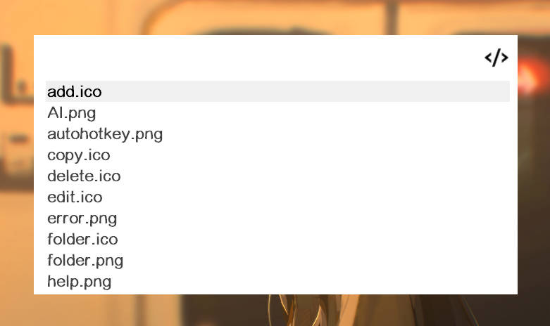
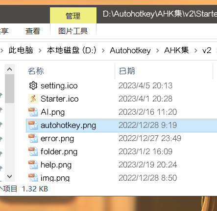

**插件模式**类似于启动模式、智能模式，但更加自由、强大，**Starter** 仅仅提供一个搜索框，其他内容全部由插件定义。

可以定义的内容包括：

1. 待搜索数据
2. 搜索处理函数
3. 运行处理函数
4. （可选）双击Right处理函数
5. （可选）加载图标处理函数
6. （可选）触底处理函数
7. （可选）粘贴内容处理函数
8. （可选）拖入文件处理函数
9. （可选）初始化函数
10. （可选）初始搜索框文本
11. （可选）搜索框占位符
12. （可选）搜索框图标

## API

进入**插件模式**需要使用 `PluginHelper.showPluginMode()` API

参数及说明：[PluginHelper.showPluginMode](../../api/showPluginMode.md)

除此之外还需要了解一下 `PluginMode` 模块的几个成员。

`PluginMode` 是使用插件模式时处理函数中 `that` 参数指向的类，我们一般只需要了解下面几个数据存储位置即可。

- `that.pluginSearchData`

`showPluginMode()`函数中第一个参数传递的数据会被储存在当前位置，意义是**可能**出现在插件模式**搜索结果**的全部静态内容

当然这个全部内容只是针对**静态内容**，[进阶](./advanced.md)中有动态获取数据的情况，就不依赖此静态内容。

- `that.pluginSearchResult`

插件应当在 `searchHandler` 即搜索处理函数中，将要显示的搜索结果储存在当前位置，方便 `runHandler` 访问。

- `that.pluginOtherData`

插件如果有额外的数据，可以存放到当前位置

::: danger
插件应用在使用**插件模式**时禁止将任何数据存储在 `PluginMode`或者说 `that` 的其他位置。

若数据较多，请嵌套至对象后存储。
:::

- `that.listView`

指向插件模式的搜索框下方列表，可以通过相关的函数对其进行操作，参考[ListView (GUI) - 语法 & 使用](https://orz707.gitee.io/v2/docs/commands/ListView.htm) 

- `that.resizeGui()`

重新计算并调整列表、窗口大小，一般在修改`listView`的内容之后调用

:::tip
`resizeGui()` 方法中会调用 `that.listView.Opt("Redraw")`，所以无需再启用重绘
:::


## 最简示例

最简示例直接上**相关部分**代码，看注释

```ahk
class Plugin_MyPlugin {
    static main() {
        SplitPath(A_LineFile, &name)
        this.name := name

        ; 添加 进入插件模式 菜单项
        m := Menu()
        m.Add("进入插件模式", (*) => this.showPluginMode())
        PluginHelper.pluginMenu.Add(this.name, m)
    }

    ; 进入插件模式
    static showPluginMode() {
        ; 临时数据
        tmpData := [
            ["明月几时有", "把酒问青天"],
            ["不知天上宫阙", "今夕是何年"],
            ["我欲乘风归去", "又恐琼楼玉宇"]
        ]
        ; 构造出我们真正需要的数据，方便在searchHandler中使用
        searchData := []
        for data in tmpData {
            searchData.Push({
                title: data[1],
                keywords: PluginHelper.Utils.chineseFirstChar(data[1]), ; 拼音首字母作为关键词
                answer: data[2]
            })
        }
        ; 释放不必要的占用，虽然不多，但要有这个意识
        tmpData := 0

        ; 此处that指的是 pluginMode 模块，即插件模式
        searchHandler(that, searchText) {
            ; 如果有搜索内容则进行匹配
            if (StrLen(searchText)) {
                that.pluginSearchResult:=[] ; 重置 pluginSearchResult
                for data in that.pluginSearchData {
                    ; 如果搜索内容是title或者keywords的一部分则添加到搜索结果
                    if (InStr(data.title, searchText) || InStr(data.keywords, searchText))
                        that.pluginSearchResult.Push(data)
                }
            } else ; 否则显示全部
                that.pluginSearchResult := that.pluginSearchData

            ; 对搜索结果进行渲染，即添加到listview中
            ;重置列表
            that.listView.Opt("-Redraw")    ;禁用重绘
            that.listView.Delete()
            for data in that.pluginSearchResult {
                ; 这里使用title作为内容
                that.listView.Add(, data.title)
            }
            ; 调整gui尺寸 并启用重绘，该函数包含了Opt("Redraw")
            that.resizeGui()
        }

        runHandler(that, rowNum) {
            ; 通过pluginSearchResult和当前启动的行号访问到当前数据
            curData := that.pluginSearchResult[rowNum]
            ; 显示当前项的诗词后半句
            ; 此处的this指的是当前插件，不要和that混淆
            PluginHelper.Utils.tip(this.name, curData.answer, 1000)
        }

        PluginHelper.showPluginMode(
            searchData,
            searchHandler,
            runHandler
        )
    }
}
```

效果如图：


## 从启动项进入

虽然可以像最简示例中一样，通过菜单而进入**插件模式**。

但是最常用的方式还是通过**插件启动项**的运行处理函数进入。

```ahk
; 添加 进入MyPlugin插件模式 启动项
PluginHelper.addPluginToStartupMode(
    this.name,
    "进入MyPlugin插件模式",
    ["进入MyPlugin插件模式", PluginHelper.Utils.chineseFirstChar("进入MyPlugin插件模式")],
    (obj, searchText) => this.showPluginMode(), ; 运行则进入插件模式
)
```


## 简易文件夹示例

这个示例中，可以通过**启动项**进入**插件模式**，显示软件图片资源文件夹内的所有文件。

可以通过文件名或者拼音首字母转换后的文件名进行**搜索筛选**，运行则**在文件夹中打开**指定项

具体如何上代码，看注释

```ahk
class Plugin_MyPlugin {
    static main() {
        SplitPath(A_LineFile, &name)
        this.name := name

        ; 添加 进入MyPlugin插件模式 启动项
        PluginHelper.addPluginToStartupMode(
            this.name,
            "简易文件夹",
            ["简易文件夹", PluginHelper.Utils.chineseFirstChar("简易文件夹")],
            (obj, searchText) => this.showPluginMode(), ; 启动则进入插件模式
        )
    }

    ; 进入插件模式
    static showPluginMode() {
        ; 构造文件夹相关数据
        searchData := []
        ; PluginHelper.imgDir 为Starter存放图片资源的目录
        loop files PluginHelper.imgDir "\*.*" {
            searchData.Push({
                title: A_LoopFileName,
                keywords: PluginHelper.Utils.chineseFirstChar(A_LoopFileName),
                path: A_LoopFileFullPath
            })
        }

        ; 此处that指的是 pluginMode 模块，即插件模式
        searchHandler(that, searchText) {
            ; 如果有搜索内容则进行匹配
            if (StrLen(searchText)) {
                that.pluginSearchResult := [] ; 重置 pluginSearchResult
                for data in that.pluginSearchData {
                    ; 如果搜索内容是title或者keywords的一部分则添加到搜索结果
                    if (InStr(data.title, searchText) || InStr(data.keywords, searchText))
                        that.pluginSearchResult.Push(data)
                }
            } else ; 否则显示全部
                that.pluginSearchResult := that.pluginSearchData

            ;重置列表
            that.listView.Opt("-Redraw")    ;禁用重绘
            that.listView.Delete()
            for data in that.pluginSearchResult
                that.listView.Add(, data.title)
            ; 调整gui尺寸 并启用重绘
            that.resizeGui()
        }

        runHandler(that, rowNum) {
            ; 通过pluginSearchResult和当前启动的行号访问到当前数据
            curData := that.pluginSearchResult[rowNum]
            ; 此处的this指的是当前插件，不要和that混淆
            PluginHelper.hideSearchGui() ; 隐藏搜索框
            PluginHelper.Utils.tip(this.name, "在文件夹中显示:`n" curData.path)
            PluginHelper.Utils.openFileInFolder(curData.path) ; 在文件夹中显示当前文件
        }

        PluginHelper.showPluginMode(
            searchData,
            searchHandler,
            runHandler, {
                thumb: PluginHelper.getPluginHIcon(this.name) ; 搜索框图标
            }
        )
    }
}
```

效果如图：






