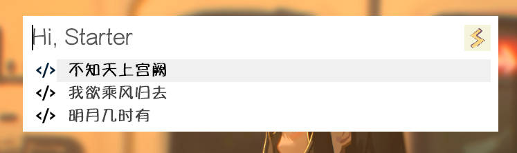

插件启动项类似于原生启动项，但是更加**自由**、**强大**。

## API

添加**插件启动项**需要使用 `PluginHelper.addPluginToStartupMode()` API

参数及说明：[PluginHelper.addPluginToStartupMode](../api/addPluginToStartupMode.md)

## 简单应用

在启动该插件项时触发某个功能，参考[快速上手 - 添加插件启动项](./get-started.md#add-plugin-to-startup-mode)

## 进阶应用

主要通过ahk**闭包特性**进行更多操作，和 `js` 中的闭包一样，用起来非常灵活。
### 1. 同时添加多个插件项

批量添加多个插件项，通过 `obj` 对象的属性、ahk**闭包特性**执行预期的内容。

```ahk
; 添加插件启动项
static addStartupItem() {
    demoData := Map(
        "明月几时有", "把酒问青天",
        "不知天上宫阙", "今夕是何年",
        "我欲乘风归去", "又恐琼楼玉宇"
    )

    ; 利用闭包特性，可以访问到demoData
    startHandler(obj, searchText) {
        PluginHelper.Utils.tip(this.name, demoData[obj.title])
    }

    for k, v in demoData {
        ; 如果startHandler闭包在此处，甚至可以直接访问到k,v
        
        PluginHelper.addPluginToStartupMode(
            this.name,
            k,
            ; 使用工具函数将其转换为拼音首字母作为关键词
            [PluginHelper.Utils.chineseFirstChar(k)],
            startHandler
        )
    }
}
```

批量添加结果



搜索拼音首字母 `wy` 得到唯一匹配启动项


启动结果如下图    


### 2. 右键菜单

右键当前项时可以通过 `contextHandler` 显示菜单，而通过**闭包**或者为函数*bind参数*可以区分出具体是哪一项

- 纯闭包实现
```ahk
; 添加插件启动项
static addStartupItem() {
    demoData := Map(
        "明月几时有", "把酒问青天",
        "不知天上宫阙", "今夕是何年",
        "我欲乘风归去", "又恐琼楼玉宇"
    )

    ; 利用闭包
    curContextObj := 0
    m := Menu()
    m.Add("显示后半句", (*) => PluginHelper.Utils.tip(this.name, demoData[curContextObj.title]))
    contextHandler(obj){
        ; 利用闭包，在显示菜单时将 curContextObj 赋值，从而能在外访问到符合预期的后半句
        curContextObj:=obj
        m.Show() ; 显示菜单
    }

    for k, v in demoData {
        PluginHelper.addPluginToStartupMode(
            this.name,
            k,
            [PluginHelper.Utils.chineseFirstChar(k)],
            (*) => 0,,
            contextHandler
        )
    }
}
```

- 闭包 + Bind 实现
```ahk
static addStartupItem() {
    demoData := Map(
        "明月几时有", "把酒问青天",
        "不知天上宫阙", "今夕是何年",
        "我欲乘风归去", "又恐琼楼玉宇"
    )

    ; 利用闭包
    words := 0
    m := Menu()
    m.Add("显示后半句", (*) => PluginHelper.Utils.tip(this.name, words))
    contextHandler(bindParam, obj) {
        ; 利用闭包，在显示菜单时将 words 赋值，从而能在外访问到符合预期的后半句
        words := bindParam
        m.Show() ; 显示菜单
    }

    for k, v in demoData {
        PluginHelper.addPluginToStartupMode(
            this.name,
            k,
            [PluginHelper.Utils.chineseFirstChar(k)],
            (*) => 0, ,
            contextHandler.Bind(v)
        )
    }
}
```

效果相同，只是思路上有细微的区别。


