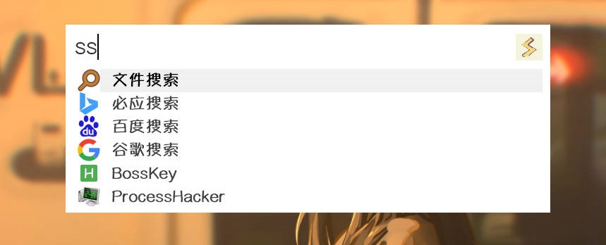
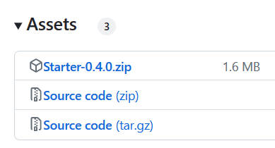
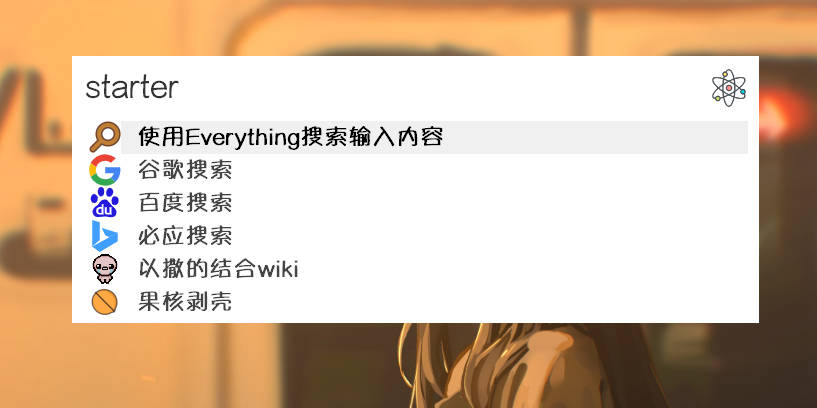
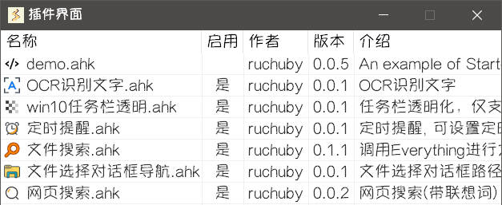

## 从这里开始

在开始使用 Starter 之前，建议先阅读[快速上手](./get-started/intro)，以便快速了解软件的基本功能和操作。

若想深入了解软件的**所有功能**，可以查阅使用指南的其他内容，其中包含了详细的介绍和操作说明。

::: tip
若在使用 Starter 过程中遇到无法解决的问题，欢迎前往 [Issues](https://github.com/ruchuby/Starter/issues) 提交问题报告。

在提交问题报告时，请尽可能提供详细的信息，例如出错时的错误提示、错误复现流程和软件版本等，以便更好地解决问题。感谢你的支持和理解！
:::

## 万能搜索框 ✨

通过搜索和情景匹配，回应符合要求的内容
## 轻量 & 绿色 ✨

Starter 使用AHK编写，绿色免安装，体积 < 2M
## 简洁 & 颜值在线 ✨

Starter 设计简洁美观，UI的「颜值即正义」
## 插件化 ✨

自由装载插件，打造个人专属效率工具