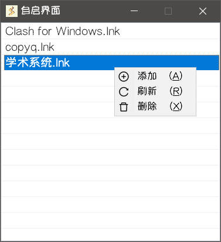

## 开机自启动

运行 **Starter** 后，右键右下角托盘图标打开菜单，点击**开机启动**，即可切换开机自启状态。

::: tip
**Starter** 开机自启通过写入注册表实现
:::

## 自启界面

运行 **Starter** 后，右键右下角托盘图标打开菜单，点击**自启界面**。

- Starter**开机自启时**会自动运行自启界面列表中的所有项，**按名称顺序**。
::: warning
**开启**开机自启时，Starter才会在**开机自启动**时运行自启界面列表中的所有项。

因为写入开机自启注册表时为启动 **Starter** 程序附加了 `"the_startup"` 命令行参数
:::

- **右键**点击列表打开**菜单**进行添加、刷新、删除操作。
- **拖动文件**到自启界面中可以**批量添加**自启项。
- **双击**列表项可以直接启动对应项。

::: tip
添加的自启项将会创建快捷方式到**用户数据目录**的 `boot` 文件夹下

如果有需要改变自启顺序，可以通过修改`boot` 文件夹对应**快捷方式的文件名**来修改顺序

比如为快捷方式文件名加上 `01`，`02` 等前缀
:::