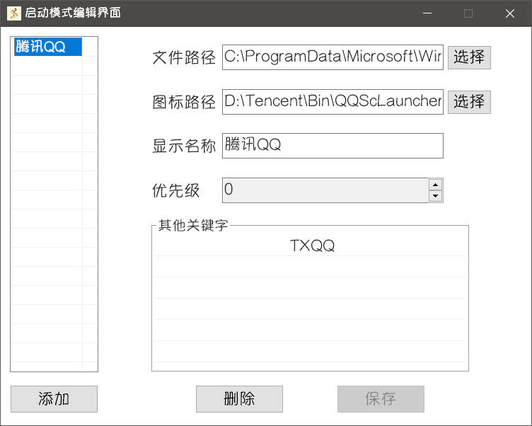

::: center

Starter

智能、快捷地启动文件、文件夹，执行操作，提高电脑的使用效率

:::

  
  
  
  

## 下载

- Github下载：[Github Releases](https://github.com/ruchuby/Starter/releases) 

- 蓝奏云下载：[蓝奏云](https://wwi.lanzoup.com/b01kb1g4j) 密码: 9vge

**Starter 优先使用** `雅痞-简` 字体，可在上方蓝奏云链接内下载安装。

## 运行

将下载的压缩包**解压**，运行文件夹中的 `创建快捷方式.bat` ，将在文件夹内创建 `Starter.lnk` 快捷方式，双击即可运行软件。

:::tip
刚刚安装好的 **Starter** 就像一张白纸，但在添加各种配置之后，它将成为你最得心应手的启动工具。
:::

## 配置启动项

运行 **Starter** 后，右键右下角托盘图标打开菜单，点击**编辑启动模式**。

::: tip
由于初次运行，没有配置任何启动项，会弹窗提示“启动列表内无可编辑项，请添加文件”。

点击确认，在随后出现的文件选择框中随意选择一个文件，比如QQ，以添加到启动列表。

然后就可以打开编辑界面，开始个性化设置启动项了。
:::

- ### 添加启动项

在启动模式编辑界面中，你可以通过两种方式来添加启动项：

1. 你可以点击界面上的**添加**按钮，在文件选择框中选择要添加的文件
2. 你也可以将所需添加的文件拖拽到窗口中，这种方式既快速又方便，可以一次性添加多个启动项。

::: tip
此处的启动项指的是非插件添加的启动项，也就是**原生启动项**，可以在启动模式编辑界面中添加、修改等。
:::

- ### 编辑启动项

**Starter** 根据**显示名称**和**其他关键字**来识别启动项。在搜索框中搜索时，只要搜索内容是 **显示名称的一部分** 或 **某行关键字的一部分**，该启动项就会出现在搜索结果中。

在启动项编辑界面，你可以直接在编辑框中输入和修改启动项的内容。此外，如果你需要增加、删除或修改其他关键字，可以右键点击其他关键字列表，打开菜单进行相应操作。最后，点击保存按钮进行保存。

## 启用插件

运行 **Starter** 后，右键右下角托盘图标打开菜单，点击**插件界面**。

在插件列表中双击任意一行，即可启用或禁用该插件。在修改完所需的插件状态后，点击**保存重载**按钮，软件会重启且只会载入所有已启用的插件。

插件的使用请参考[插件指南](../../plugin/)

## 开始使用

- 呼出搜索框

双击 `CapsLK` 按键，呼出**启动模式搜索框**，输入任意内容，可以看到搜索结果列表。

- 切换选中项

`Up`、`Down` 按键可在列表中**上下切换**选中的条目。

`Alt` + `数字` 按键可以快速选中**当前视图**中的第n个条目 (`Alt` + `0` 代表选中第10个)。

- 启动选中项

`回车` 可以启动当前选中项。

- 文件夹中显示

双击 `Right`按键可以在文件夹中显示当前选中的**原生启动项**。

::: tip
如果该启动项来自于某个插件，即**插件启动项**，则执行相应的插件设定。
:::

- 清空与关闭

`Esc`按键将**清空** 输入内容，或者**隐藏**搜索界面。

搜索界面失去焦点一段时间后**自动隐藏**，自动隐藏后15s内**保留搜索结果**。

- 右键菜单

右键点击任意结果条目，将会打开菜单以进行更多操作。

## 更多

::: tip
以上是 **Starter** 中最简单、常用的搜索与启动功能，是你快速上手 **Starter** 的最好方式。
:::

**Starter** 还具备其他更丰富的功能，比如[插件](../../plugin/)、[智能模式](../intelligent/)、[开机启动](../boot/)等等
，建议你细读本文档的其他章节，探索其他功能。

