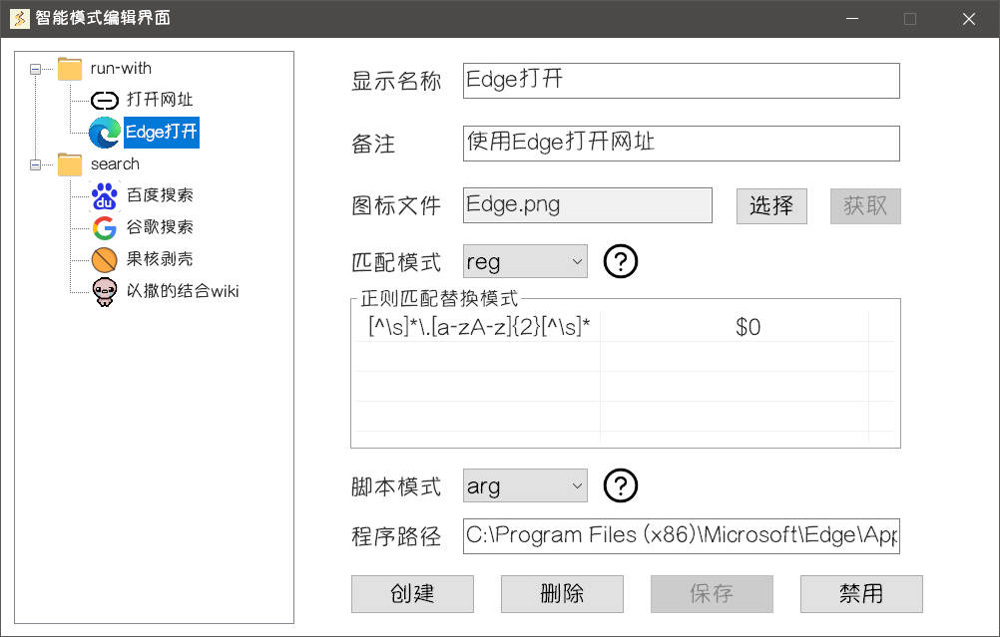
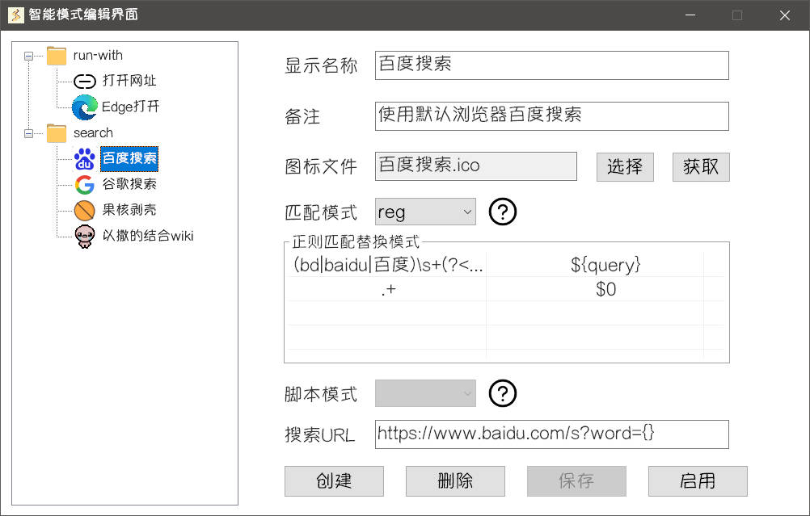

智能模式的功能比较特殊，有一些相关概念需要你提前了解，以便更好地理解如何使用智能模式。

## 智能项

**原生智能项**是指你在智能模式编辑界面中手动添加、删除或修改的智能项，与插件无关。

**插件智能项**是指通过插件添加的智能项。插件智能项只能通过插件的编写者更新或修改，有的插件可能会为用户提供**增删改**智能项的方式。

::: tip
本章提到的内容都针对**原生智能项**，非开发者只需要了解**原生智能项**即可，若有兴趣请移步[插件开发 - 插件智能项](../../dev/intelligent/basics.md)
:::

**原生智能项**的功能或许很强大，或许很鸡肋，因人而异。

- 它可以根据你的文本输入，快速打开某个网页的搜索页面，并搜索输入的内容。

- 它可以根据你的文本输入，启动某个程序，并传递输入的命令行参数。

::: warning
接下来的内容比较复杂、繁琐，如果你没有上诉需求或者不喜欢折腾，可以停止阅读本章。
:::

## 匹配模式

**匹配**指的是当前智能项会出现在搜索结果中，设定不同匹配模式可以灵活的匹配不同的输入内容

::: warning
目前，**原生智能项**仅支持匹配**文本**输入类型的内容，暂时不支持**工作窗口信息、文件、位图**等输入类型的匹配。

这是为了避免**原生智能项**的相关概念变得更加复杂，同时也降低了**智能模式编辑界面**的复杂程度。

**工作窗口信息、文件、位图**等输入类型，只有**插件智能项**才可以设定相关的匹配条件，相关内容请移步[插件开发 - 插件智能项](../../dev/intelligent/basics.md)
:::

### 1. 字符串模式(str)

**智能模式搜索框**输入内容为**任意字符串**时匹配，输入内容**原封不动地传递**给启动处理程序。

::: tip
启动处理程序具体做什么在后续会有解释，此时你只要知道它会接收**传递的内容**作为参数进行后续处理
:::

### 2. 正则匹配替换模式(reg)

在**正则匹配替换模式**下，原生智能项会有一个正则表达式二元列表，列表的每项包含一对表达式：**匹配表达式**，**替换表达式**

在智能模式搜索框输入文本时，对于每个原生智能项，**Starter** 依次使用该项中所有**匹配表达式**进行正则匹配，直到有一个表达式与输入文本匹配为止。如果所有表达式都无法匹配，则该智能项不会出现在搜索结果中。

::: tip
对某个智能项的**匹配表达式**的匹配顺序是**从上到下**，也就是排在越前面的表达式优先级越高。
:::

对于这一类智能项，**Starter** 将使用该项的替换表达式对输入内容进行替换，替换后的结果就是所谓的**传递的内容**。

正则匹配与替换参考:

1. [正则表达式30分钟入门教程 (deerchao.cn)](https://deerchao.cn/tutorials/regex/regex.htm#mission)
2. [RegExReplace - 语法 & 使用 | AutoHotkey v2](https://orz707.gitee.io/v2/docs/commands/RegExReplace.htm)

### 3. 匹配优先级

搜索结果展示的优先级取决于匹配规则的优先级，匹配规则的优先级越高在搜索结果越靠前。在**原生智能项**中，所有 `reg` 匹配的规则优先级都高于 `str` 匹配的规则，而**插件智能项**的规则优先级更高。

## 智能项分组

**原生启动项**有两个分组，**启动分组**和**搜索分组**，不同分组中的**启动处理程序**略有区别

启动处理接下来介绍不同分组、不同条件下**启动处理程序**的具体功能

### 1. 启动分组(run-with)

**启动处理程序**将收到的**传递内容**按当前原生智能项的**脚本模式**执行启动。

::: tip
脚本模式是**启动分组**内原生智能项**特有**的选项，**搜索分组**内原生智能项不具有该选项
:::

- 空模式(none)

启动处理程序**直接执行传递的内容**，即直接执行 `Run(传递的内容)`，此时程序路径无效。

`Run()` 函数细节可参考[Run / RunWait - 语法 & 使用 ](https://orz707.gitee.io/v2/docs/commands/Run.htm)中的 `Target` 参数。

- 单参数模式(arg)

启动处理程序将**传递的内容**视为**一个**命令行参数(对**传递的内容**中的双引号进行转义，再用双引号包裹)，然后用此参数启动填写的**程序路径**

即执行 `Run(程序路径 "传递的内容")`

- 多参数模式(args)

启动处理程序将**传递的内容**视为**完整的**命令行参数(对**传递的内容**不做任何处理)，用此参数启动填写的**程序路径**。

即执行 `Run(程序路径 传递的内容)`

### 2. 搜索分组(search)

**启动处理程序**将收到的内容填充到**搜索URL**中"{}"所在位置，启动填充后的URL。

::: tip
启动处理程序的根本功能就是 `Run(Target)` 参考[Run / RunWait - 语法 & 使用 ](https://orz707.gitee.io/v2/docs/commands/Run.htm)
:::