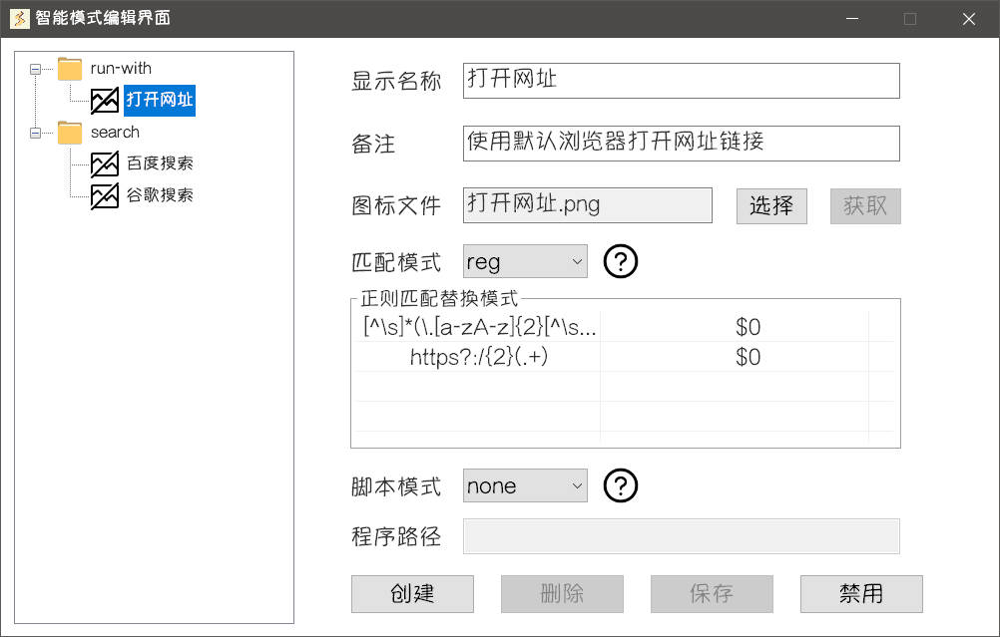

在理解了智能模式的相关概念之后，你就可以正确地配置**原生智能项**了

## 智能项示例

右键右下角托盘图标打开菜单，点击**编辑智能模式**，进入**智能模式编辑界面**

默认情况下，**Starter** 带有三个**原生智能项**作为你配置智能项的参考。你可以根据需要添加、编辑或删除智能项，以便根据个人习惯打开应用程序、网站等。

打开网址位于**启动分组**，百度搜索和谷歌搜索位于**搜索分组**。匹配模式都是 `reg`，即使用正则表达式进行匹配和替换。

接下来依次解释这三个实例的具体功能与含义，可以与[基本概念](./concept.md)相互对照。

### 1. 打开网址

该智能项带有两对正则表达式

1. `[^\s]*(\.[a-zA-z]{2}[^\s]*){2}`，`$0` 

    匹配带有两个以上"."的文本，不替换任何内容（实际上是将原始文本替换成原始文本）

2. `https?:/{2}(.+)`，`$0`

    匹配以 `http://` 或者 `https://` 开头的文本，不替换任何内容（同上）

脚本模式为 `none`，启动处理程序直接执行输入的内容

**实现的效果就是如果输入文本是网址链接，那么将使用默认浏览器打开这个链接**

### 2. 百度搜索 {#baidu-search-example}

该智能项带有一对正则表达式

`(bd|baidu|百度)\s+(?<query>.*)`, `${query}`

匹配以 `bd`、`baidu`、`百度` 开头 + `空格` + `搜索词` 的文本，将原始文本替换为`搜索词`

示例：`bd xxx` 将被替换为 `xxx`，作为**传递的内容**。

**实现的效果就是如果输入文本是 `bd xxx`，那么将使用默认浏览器进行百度搜索 `xxx`**

### 3. 谷歌搜索

该智能项带有一对正则表达式

`(gg|谷歌)\s+(?<query>.*)`, `${query}`

与 [2. 百度搜索](#baidu-search-example) 一样，除了开头是 `gg` 或 `谷歌`

**实现的效果就是如果输入文本是 `gg xxx`，那么将使用默认浏览器进行百度搜索 `xxx`**

## 更多配置

1. 在 `reg` 匹配模式时，右键**正则匹配替换模式列表**可以打开菜单，进行添加、修改、删除等操作。
2. 在**图标文件**一栏中，点击**选择**按钮，可以选择带有图片资源的文件作为智能项的图标，储存至用户数据。
3. 在**搜索分组**时，点击**获取**按钮，可以尝试获取**搜索URL**对应的网站图标，下载至用户数据。
