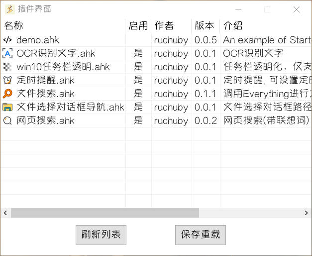

运行 **Starter** 后，右键右下角托盘图标打开菜单，点击**插件界面**。

- **双击**列表项可以启用/禁用插件
- 点击**保存重载**，可以保存当前启用/禁用状态，然后重启软件以加载启用的插件
- 点击**刷新列表**，可以重新读取插件目录内的插件信息，刷新插件界面列表
- 插件使用帮助，移请步[插件指南](../../plugin/)
- 自定义插件开发，请移步[插件开发](../../dev/)