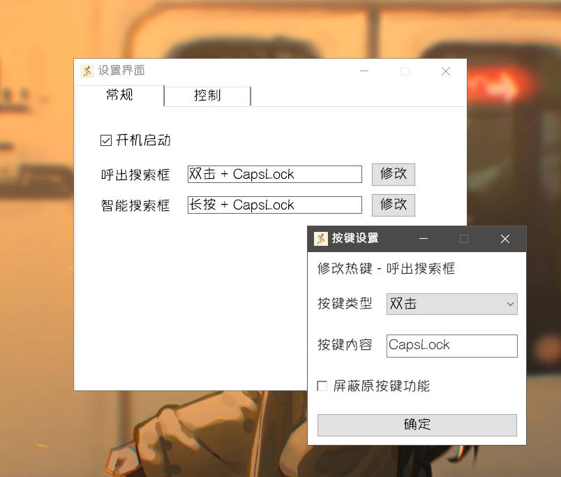
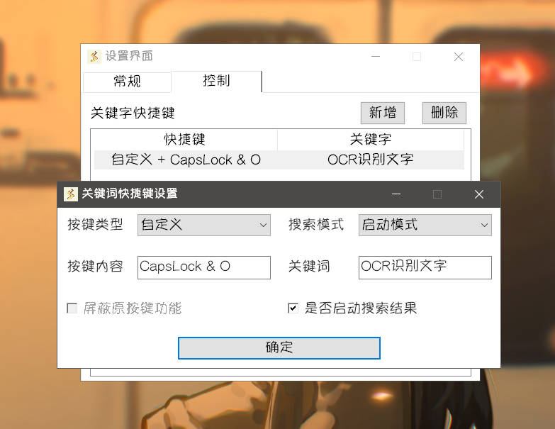

运行 **Starter** 后，右键右下角托盘图标打开菜单，点击**设置界面**。

## 常规

可通过勾选**开机自启**，修改软件是否开启自启动。

对于其他快捷键类型的设置项目，点击**修改**按钮可以修改对应的功能快捷键。

显示了每个快捷键的**具体内容**，若按键**无效**也会有对应显示。

快捷键设置，点击**修改**按钮可以修改对应的功能快捷键。

显示每个快捷键的**具体内容**，若按键**无效**也会有对应显示。

### 1. 按键类型 - 普通

普通按键类型仅仅支持 `Ctrl`, `Alt`, `Shift` 作为修饰的组合按键，或者单独按键。

可勾选**是否屏蔽原按键功能**，勾选后快捷键原功能将被屏蔽。

点击按键内容**热键输入框**，按下指定按键即可显示输入的按键内容，点击**确定**进行保存。

### 2. 按键类型 - 自定义

**自定义**按键类型可以**自由填写**热键内容，包括鼠标按键等，

参考[热键 - 定义 & 使用 | AutoHotkey v2](https://orz707.gitee.io/v2/docs/Hotkeys.htm#toc)

:::warning
热键内容的填写需要有一定AHK经验，否则建议使用其他类型
:::

### 3. 按键类型 - 双击

**双击**按键类型必须填写**单个**按键名，

参考[按键列表(键盘, 鼠标和操纵杆) | AutoHotkey v2](https://orz707.gitee.io/v2/docs/KeyList.htm)

可勾选**是否屏蔽原按键功能**，勾选后快捷键原功能将被屏蔽。

:::tip
双击要求第一次键击**按住**时间小于500ms，且第一次键击**松开**到第二次键击**按下**的时间间隔小于500ms
:::

### 4. 按键类型 - 长按

**双击**按键类型必须填写**单个**按键名，

参考[按键列表(键盘, 鼠标和操纵杆) | AutoHotkey v2](https://orz707.gitee.io/v2/docs/KeyList.htm)

可勾选**是否屏蔽原按键功能**，勾选后快捷键原功能将被屏蔽。

:::tip
长按要求第一次键击**按住**时间超过500ms
:::

## 控制

- 可以在此处点击按钮来添加、删除**关键词快捷键**
- 双击列表中任意项可以修改对应**关键词快捷键**

按下关键词快捷键可以快速*以指定模式*搜索*既定的关键词*，并可选**是否启动搜索结果的第一项**。

:::tip
以截图中的关键词快捷键内容为例：

1. 快捷键为 `CapsLock & O`，即按下`CapsLock` + `O` 快捷键触发
2. 搜索模式为启动模式
3. 关键词为“OCR识别文字”
4. 勾选了启动搜索结果

添加上述关键词快捷键后，就可以通过按下`CapsLock` + `O`快速启动搜索“OCR识别文字”，并启动搜索结果。

由于搜索到的首个结果是**插件启动项**`OCR识别文字`，因此可以实现快捷键启动该插件。
:::
