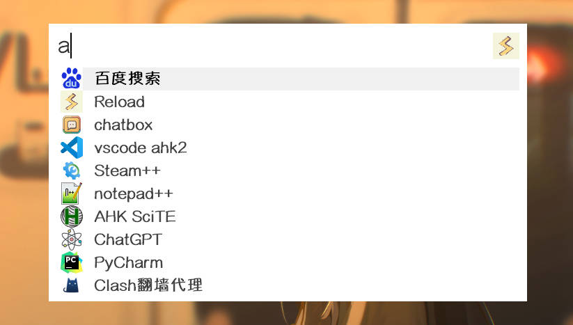
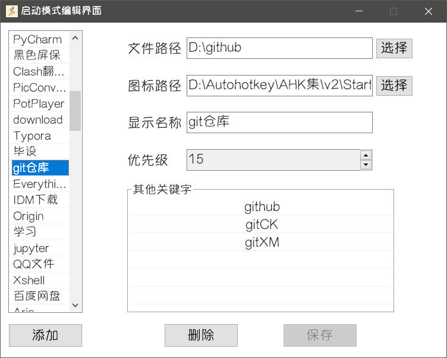

启动模式的使用，在 [快速上手 - 下载与使用](../get-started/install-usage.md) 已经描述了一遍，在此作为一个补充。

::: warning
此处的启动项指的是**非插件添加的**启动项，也就是**原生启动项**，可以在启动模式编辑界面中添加、修改等。
:::

## 匹配

**Starter** 根据**显示名称**和**其他关键字**来识别原生启动项。

在**启动模式搜索框**中搜索时，只要搜索内容是 **显示名称的一部分** 或 **某关键字的一部分**，该启动项就会出现在搜索结果中。

## 配置

### 1. 编辑界面

运行 **Starter** 后，右键右下角托盘图标打开菜单，点击**编辑启动模式**。

没有配置任何启动项，会弹窗提示“启动列表内无可编辑项，请添加文件”，在弹窗后出现的文件选择框中选择任意文件添加为启动项即可。

### 2. 添加启动项

你可以通过3种方式来添加启动项：

1. 点击**启动模式编辑界面**上的**添加**按钮，在文件选择框中选择要添加的文件
2. 将所需添加的文件拖拽到**启动模式编辑界面**窗口中，这种方式既快速又方便，可以一次性添加多个启动项。
3. 将所需添加的文件拖拽到**启动模式搜索框**中，这种方式类似于第二种，但由于**搜索框会自动隐藏**，需要一定的手速。

### 3. 编辑启动项

在启动项编辑界面，你可以直接在编辑框中输入和修改启动项的内容。

- **图标路径**可以指向任意含有图像资源的文件，若图标加载失败，**Starter**会使用默认图标代替。
- **文件路径**指向的文件不存在时，该启动项在搜索结果的图标将变成警告图标。
- **优先级**指的是启动项在启动模式搜索结果中排序的优先级，数字越大排序越靠前。

::: tip
启动项带有**动态优先级**，**每次**启动、在文件夹中打开，都会**增加**启动项的优先级，范围 0-999。

**原生启动项**的优先级 < **插件启动项**的优先级
:::

- 右键点击**其他关键字列表**，可以打开菜单进行增加、删除或修改操作。

## 使用

- 呼出搜索框

双击 `CapsLK` 按键，呼出**启动模式搜索框**，输入任意内容，可以看到搜索结果列表。

- 切换选中项

`Up`、`Down` 按键可在列表中**上下切换**选中的条目。

`Alt` + `数字` 按键可以快速选中**当前视图**中的第n个条目 (`Alt` + `0` 代表选中第10个)。

- 启动选中项

`回车` 可以启动当前选中项。

- 文件夹中显示

双击 `Right`按键可以在文件夹中显示当前选中的**原生启动项**的文件路径。

- 清空与关闭

`Esc`按键将**清空** 输入内容，或者**隐藏**搜索界面。

搜索界面失去焦点一段时间后**自动隐藏**，自动隐藏后15s内**保留搜索结果**。

- 右键菜单

右键点击任意结果条目，将会打开菜单以进行更多操作。

