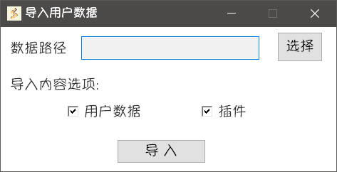

右键右下角托盘图标打开软件菜单，点击**用户数据**进入**子菜单**

## 打开数据目录

打开用户数据所在目录

## 导出用户数据

进入导出用户数据界面，选择保存目录、导出选项，将相关内容导出为 **zip** 文件

## 导入用户数据

进入导入用户数据界面，选择数据路径、导入选项，将相关内容导入至 **Starter**

::: warning
导入的内容会直接覆盖同名文件，担心误操作请提前导出数据作为备份
:::