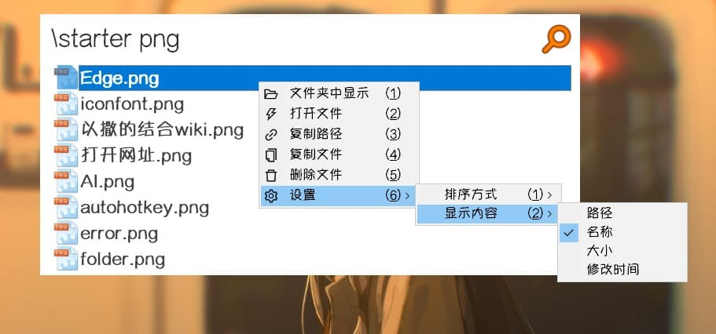

## 介绍

调用Everything进行文件搜索。

## 插件项入口

### 1.启动模式

关键词为`["WJSS", "Everything"]`

### 2. 智能模式

- 输入任意内容，进入插件时保留输入内容 (优先级为 **1**)
- 搜索框带有**单个文件夹**时，进入插件时保留输入内容和文件夹信息 (优先级为 **1**)
- 搜索框带有**单个文件夹**时且输入 `Everything`, `WJSS` 开头或全部的文本, 进入插件时**不保留输入内容**但**保留文件夹信息** (优先级为 **2**)

::: tip
优先级越高，在搜索结果中排序越靠前，且**插件智能项**优先级高于**原生智能项**。
:::

## 使用方式

1. 搜索语法见: [Searching - voidtools](https://www.voidtools.com/zh-cn/support/everything/searching/)
2. 右键任意搜索结果打开功能菜单，进行文件夹中显示、复制、删除、设置等操作
3. 双击`Right`键也可以打开功能菜单
4. 搜索框可以拖入、粘贴**单个文件夹**，此时将在该文件夹内搜索

::: tip
相当于加入前缀 `"文件夹路径xxx"` + `空格`
:::
