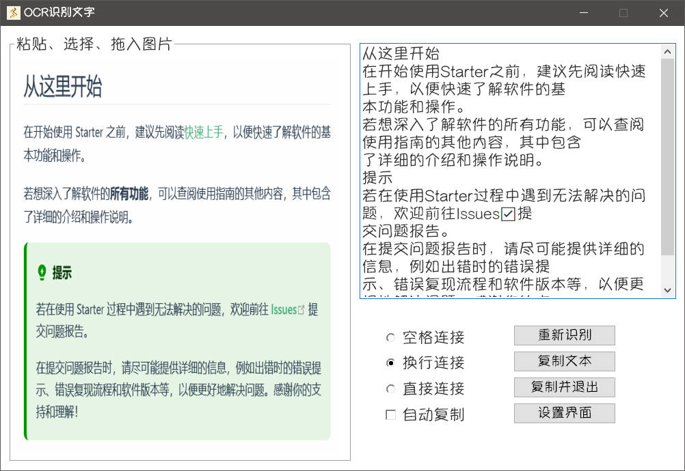

## 介绍

调用百度OCR在线识别文字，需要自行申请API密钥

## 配置

请先申请百度OCR，方法自行上网搜索。

右键 **Starter** 右下角托盘图标 > **Starter菜单** > **插件功能** > **OCR识别文字** > **设置**

设置界面分别填入申请到的 `id` 和 `secret` ，点击**保存**

## 使用

- ### 方式一

使用任意截图工具截取图片到**剪切板**，呼出**搜索框**，粘贴，转到**智能模式搜索框**

启动对应**插件智能项**进入识别界面，并识别图片

- ### 方式二

启动模式搜索框中关键词为`["OCR识别文字", "OCRSBWZ"]`

启动对应**插件启动项**进入识别界面

- ### 方式三

右键 **Starter** 右下角托盘图标 > **Starter菜单** > **插件功能** > **OCR识别文字** > **显示**，进入识别界面

## 识别界面

左侧为正在识别的图片，**不用在意显示的图片变形，仅仅是控件显示问题**

右侧为识别结果

:::tip
**直接粘贴图片**就可以进行图片识别

**点击左侧图片**位置可以通过文件选择进行图片识别
:::

::: warning
修改识别结果**连接方式**或者**自动复制**选项时，打开**设置界面**并点击保存，

**下次启动时才会使用保存的选择**
:::