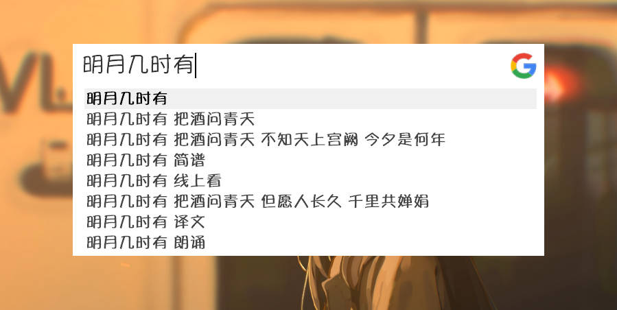
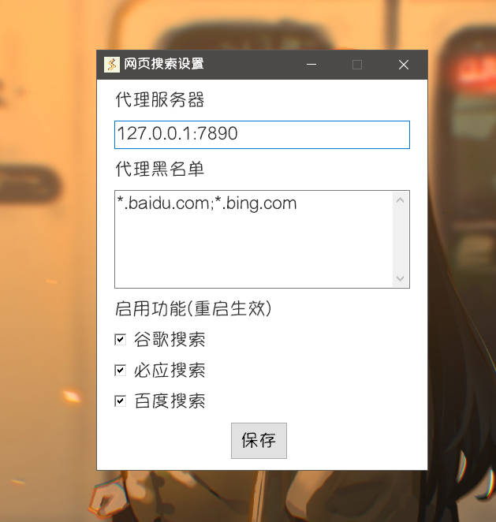

## 介绍

进行百度、必应、谷歌网页搜索，输入搜索内容时显示搜索联想词。

## 配置

右键 **Starter** 右下角托盘图标 > **Starter菜单** > **插件功能** > **网页搜索** > **设置**

**谷歌搜索**国内需要使用代理，通过本地socket代理的方式连通网络。

如果有需要可以考虑[蓝色海洋](https://abcloud365.xyz/index.php#/register?code=lyUxxqMu)，配合Clash使用

