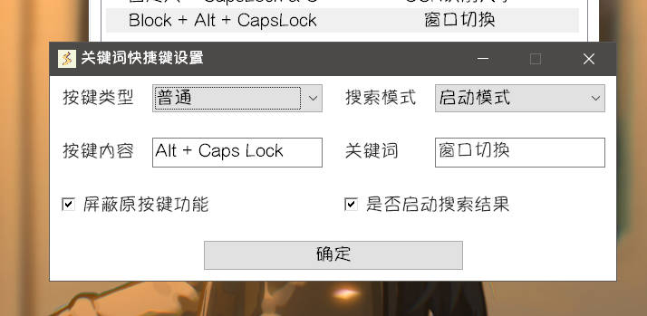

## 介绍

窗口切换功能，模仿Switcheroo

显示当前窗口列表，输入内容对列表进行检索，支持拼音首字母。

## 使用方式

插件入口在启动模式中，其他关键词为`["CKQH"]`。

启动该插件启动项，进入窗口切换插件。

当未输入任何内容时，在搜索结果中可以看到当前所有窗口的标题列表，即介绍中的第一张图片。

输入任意文本，即可对窗口标题进行检索，**支持拼音首字母**。

最后，启动某列表项即可完成切换到指定窗口。

## 进阶技巧

添加对应的[关键词快捷键](https://AkiChase.github.io/Starter/guide/setting/#控制)，可以通过快捷键**快速启动插件**。

参考设置如上图，可以通过按下`Alt` + `CapsLK`快捷键来启动该插件。

:::tip
如果需要用来代替`Alt` + `Tab`功能，请将**按键类型**设置为**自定义**，**按键内容**设置为`!Tab`
:::