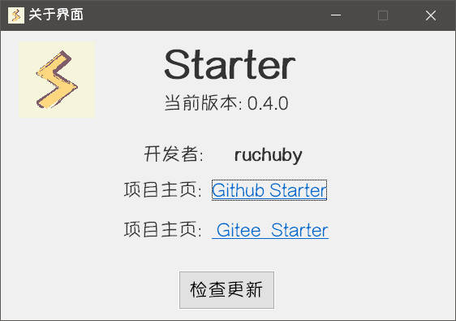

## 关于界面

运行 **Starter** 后，右键右下角托盘图标打开菜单，点击**关于界面**。

- 显示当前版本号
- 显示项目主页
- 检查更新按钮

## 检查更新

软件启动时会进行一次检查更新，也可以通过自启界面的检查更新按钮来手动检查。

更新需要前往项目主页，或者其他版本发布地址手动下载最新版本。

更新版本前记得导出旧版的数据文件，以导入新版本中。

::: tip
考虑到很多人无法访问GitHub，所以检查更新基于同步的Gitee仓库的Tags

效果一般，仅仅能检测版本号
:::